# Direct PRNG comparison

The following 31 pseudorandom numbers generators (PRNG) have been tested to generate pseudorandom numbers (PRN) according to **exponential**, **log-normal**, **gamma**, **triangular**, **Poisson**, and **geometric** distribution:

* ThreadLocalRandom
* Random
* SecureRandom
* Well512a
* Well1024a
* Well19937a
* Well19937c
* Well44497a
* Well44497b
* MersenneTwister
* SFC64
* ISAAC
* XoRoShiRo128++
* XoRoShiRo128**
* XoRoShiRo64**
* XoRoShiRo256++
* XoRoShiRo1024++
* XoRoShiRo1024*
* XoRoShiRo1024**
* L32X64Mix
* L64X128Mix
* L64X128
* L64X256Mix
* L64X1024Mix
* L128X128Mix
* L128X256Mix
* L128X1024Mix
* PcgRxsMXs64
* Philox4x64
* Drand48
* Drand48Mix

## Error between theoretical values and values after 108. generated PRN

### Mean value of the generated PRN

<table id="T_b12c1">
  <caption>Mean Error (in %)</caption>
  <thead>
    <tr>
      <th class="blank level0" >&nbsp;</th>
      <th id="T_b12c1_level0_col0" class="col_heading level0 col0" >Exponential</th>
      <th id="T_b12c1_level0_col1" class="col_heading level0 col1" >Log-Normal</th>
      <th id="T_b12c1_level0_col2" class="col_heading level0 col2" >Gamma</th>
      <th id="T_b12c1_level0_col3" class="col_heading level0 col3" >Triangular</th>
      <th id="T_b12c1_level0_col4" class="col_heading level0 col4" >Poisson</th>
      <th id="T_b12c1_level0_col5" class="col_heading level0 col5" >Geometric</th>
    </tr>
  </thead>
  <tbody>
    <tr>
      <th id="T_b12c1_level0_row0" class="row_heading level0 row0" >ThreadLocalRandom</th>
      <td id="T_b12c1_row0_col0" class="data row0 col0" >0.00009%</td>
      <td id="T_b12c1_row0_col1" class="data row0 col1" >0.00049%</td>
      <td id="T_b12c1_row0_col2" class="data row0 col2" >0.00013%</td>
      <td id="T_b12c1_row0_col3" class="data row0 col3" >0.00003%</td>
      <td id="T_b12c1_row0_col4" class="data row0 col4" >0.00006%</td>
      <td id="T_b12c1_row0_col5" class="data row0 col5" >0.00154%</td>
    </tr>
    <tr>
      <th id="T_b12c1_level0_row1" class="row_heading level0 row1" >Random</th>
      <td id="T_b12c1_row1_col0" class="data row1 col0" >0.00170%</td>
      <td id="T_b12c1_row1_col1" class="data row1 col1" >0.00012%</td>
      <td id="T_b12c1_row1_col2" class="data row1 col2" >0.00100%</td>
      <td id="T_b12c1_row1_col3" class="data row1 col3" >0.00015%</td>
      <td id="T_b12c1_row1_col4" class="data row1 col4" >0.00001%</td>
      <td id="T_b12c1_row1_col5" class="data row1 col5" >0.00159%</td>
    </tr>
    <tr>
      <th id="T_b12c1_level0_row2" class="row_heading level0 row2" >SecureRandom</th>
      <td id="T_b12c1_row2_col0" class="data row2 col0" >0.00055%</td>
      <td id="T_b12c1_row2_col1" class="data row2 col1" >0.00065%</td>
      <td id="T_b12c1_row2_col2" class="data row2 col2" >0.00010%</td>
      <td id="T_b12c1_row2_col3" class="data row2 col3" >0.00014%</td>
      <td id="T_b12c1_row2_col4" class="data row2 col4" >0.00014%</td>
      <td id="T_b12c1_row2_col5" class="data row2 col5" >0.00164%</td>
    </tr>
    <tr>
      <th id="T_b12c1_level0_row3" class="row_heading level0 row3" >Well512a</th>
      <td id="T_b12c1_row3_col0" class="data row3 col0" >0.00099%</td>
      <td id="T_b12c1_row3_col1" class="data row3 col1" >0.00021%</td>
      <td id="T_b12c1_row3_col2" class="data row3 col2" >0.00021%</td>
      <td id="T_b12c1_row3_col3" class="data row3 col3" >0.00028%</td>
      <td id="T_b12c1_row3_col4" class="data row3 col4" >0.00003%</td>
      <td id="T_b12c1_row3_col5" class="data row3 col5" >0.00042%</td>
    </tr>
    <tr>
      <th id="T_b12c1_level0_row4" class="row_heading level0 row4" >Well1024a</th>
      <td id="T_b12c1_row4_col0" class="data row4 col0" >0.00100%</td>
      <td id="T_b12c1_row4_col1" class="data row4 col1" >0.00010%</td>
      <td id="T_b12c1_row4_col2" class="data row4 col2" >0.00038%</td>
      <td id="T_b12c1_row4_col3" class="data row4 col3" >0.00017%</td>
      <td id="T_b12c1_row4_col4" class="data row4 col4" >0.00001%</td>
      <td id="T_b12c1_row4_col5" class="data row4 col5" >0.00025%</td>
    </tr>
    <tr>
      <th id="T_b12c1_level0_row5" class="row_heading level0 row5" >Well19937a</th>
      <td id="T_b12c1_row5_col0" class="data row5 col0" >0.00056%</td>
      <td id="T_b12c1_row5_col1" class="data row5 col1" >0.00063%</td>
      <td id="T_b12c1_row5_col2" class="data row5 col2" >0.00009%</td>
      <td id="T_b12c1_row5_col3" class="data row5 col3" >0.00050%</td>
      <td id="T_b12c1_row5_col4" class="data row5 col4" >0.00006%</td>
      <td id="T_b12c1_row5_col5" class="data row5 col5" >0.00001%</td>
    </tr>
    <tr>
      <th id="T_b12c1_level0_row6" class="row_heading level0 row6" >Well19937c</th>
      <td id="T_b12c1_row6_col0" class="data row6 col0" >0.00101%</td>
      <td id="T_b12c1_row6_col1" class="data row6 col1" >0.00022%</td>
      <td id="T_b12c1_row6_col2" class="data row6 col2" >0.00009%</td>
      <td id="T_b12c1_row6_col3" class="data row6 col3" >0.00041%</td>
      <td id="T_b12c1_row6_col4" class="data row6 col4" >0.00002%</td>
      <td id="T_b12c1_row6_col5" class="data row6 col5" >0.00010%</td>
    </tr>
    <tr>
      <th id="T_b12c1_level0_row7" class="row_heading level0 row7" >Well44497a</th>
      <td id="T_b12c1_row7_col0" class="data row7 col0" >0.00056%</td>
      <td id="T_b12c1_row7_col1" class="data row7 col1" >0.00018%</td>
      <td id="T_b12c1_row7_col2" class="data row7 col2" >0.00080%</td>
      <td id="T_b12c1_row7_col3" class="data row7 col3" >0.00008%</td>
      <td id="T_b12c1_row7_col4" class="data row7 col4" >0.00011%</td>
      <td id="T_b12c1_row7_col5" class="data row7 col5" >0.00045%</td>
    </tr>
    <tr>
      <th id="T_b12c1_level0_row8" class="row_heading level0 row8" >Well44497b</th>
      <td id="T_b12c1_row8_col0" class="data row8 col0" >0.00049%</td>
      <td id="T_b12c1_row8_col1" class="data row8 col1" >0.00029%</td>
      <td id="T_b12c1_row8_col2" class="data row8 col2" >0.00019%</td>
      <td id="T_b12c1_row8_col3" class="data row8 col3" >0.00088%</td>
      <td id="T_b12c1_row8_col4" class="data row8 col4" >0.00006%</td>
      <td id="T_b12c1_row8_col5" class="data row8 col5" >0.00004%</td>
    </tr>
    <tr>
      <th id="T_b12c1_level0_row9" class="row_heading level0 row9" >MersenneTwister</th>
      <td id="T_b12c1_row9_col0" class="data row9 col0" >0.00014%</td>
      <td id="T_b12c1_row9_col1" class="data row9 col1" >0.00031%</td>
      <td id="T_b12c1_row9_col2" class="data row9 col2" >0.00066%</td>
      <td id="T_b12c1_row9_col3" class="data row9 col3" >0.00023%</td>
      <td id="T_b12c1_row9_col4" class="data row9 col4" >0.00002%</td>
      <td id="T_b12c1_row9_col5" class="data row9 col5" >0.00104%</td>
    </tr>
    <tr>
      <th id="T_b12c1_level0_row10" class="row_heading level0 row10" >SFC64</th>
      <td id="T_b12c1_row10_col0" class="data row10 col0" >0.00159%</td>
      <td id="T_b12c1_row10_col1" class="data row10 col1" >0.00024%</td>
      <td id="T_b12c1_row10_col2" class="data row10 col2" >0.00041%</td>
      <td id="T_b12c1_row10_col3" class="data row10 col3" >0.00042%</td>
      <td id="T_b12c1_row10_col4" class="data row10 col4" >0.00004%</td>
      <td id="T_b12c1_row10_col5" class="data row10 col5" >0.00095%</td>
    </tr>
    <tr>
      <th id="T_b12c1_level0_row11" class="row_heading level0 row11" >ISAAC</th>
      <td id="T_b12c1_row11_col0" class="data row11 col0" >0.00008%</td>
      <td id="T_b12c1_row11_col1" class="data row11 col1" >0.00021%</td>
      <td id="T_b12c1_row11_col2" class="data row11 col2" >0.00024%</td>
      <td id="T_b12c1_row11_col3" class="data row11 col3" >0.00027%</td>
      <td id="T_b12c1_row11_col4" class="data row11 col4" >0.00004%</td>
      <td id="T_b12c1_row11_col5" class="data row11 col5" >0.00054%</td>
    </tr>
    <tr>
      <th id="T_b12c1_level0_row12" class="row_heading level0 row12" >XoRoShiRo128++</th>
      <td id="T_b12c1_row12_col0" class="data row12 col0" >0.00062%</td>
      <td id="T_b12c1_row12_col1" class="data row12 col1" >0.00005%</td>
      <td id="T_b12c1_row12_col2" class="data row12 col2" >0.00048%</td>
      <td id="T_b12c1_row12_col3" class="data row12 col3" >0.00001%</td>
      <td id="T_b12c1_row12_col4" class="data row12 col4" >0.00007%</td>
      <td id="T_b12c1_row12_col5" class="data row12 col5" >0.00115%</td>
    </tr>
    <tr>
      <th id="T_b12c1_level0_row13" class="row_heading level0 row13" >XoRoShiRo128**</th>
      <td id="T_b12c1_row13_col0" class="data row13 col0" >0.00109%</td>
      <td id="T_b12c1_row13_col1" class="data row13 col1" >0.00025%</td>
      <td id="T_b12c1_row13_col2" class="data row13 col2" >0.00078%</td>
      <td id="T_b12c1_row13_col3" class="data row13 col3" >0.00018%</td>
      <td id="T_b12c1_row13_col4" class="data row13 col4" >0.00014%</td>
      <td id="T_b12c1_row13_col5" class="data row13 col5" >0.00049%</td>
    </tr>
    <tr>
      <th id="T_b12c1_level0_row14" class="row_heading level0 row14" >XoRoShiRo64**</th>
      <td id="T_b12c1_row14_col0" class="data row14 col0" >0.00022%</td>
      <td id="T_b12c1_row14_col1" class="data row14 col1" >0.00002%</td>
      <td id="T_b12c1_row14_col2" class="data row14 col2" >0.00003%</td>
      <td id="T_b12c1_row14_col3" class="data row14 col3" >0.00038%</td>
      <td id="T_b12c1_row14_col4" class="data row14 col4" >0.00001%</td>
      <td id="T_b12c1_row14_col5" class="data row14 col5" >0.00108%</td>
    </tr>
    <tr>
      <th id="T_b12c1_level0_row15" class="row_heading level0 row15" >XoRoShiRo256++</th>
      <td id="T_b12c1_row15_col0" class="data row15 col0" >0.00063%</td>
      <td id="T_b12c1_row15_col1" class="data row15 col1" >0.00003%</td>
      <td id="T_b12c1_row15_col2" class="data row15 col2" >0.00025%</td>
      <td id="T_b12c1_row15_col3" class="data row15 col3" >0.00052%</td>
      <td id="T_b12c1_row15_col4" class="data row15 col4" >0.00001%</td>
      <td id="T_b12c1_row15_col5" class="data row15 col5" >0.00127%</td>
    </tr>
    <tr>
      <th id="T_b12c1_level0_row16" class="row_heading level0 row16" >XoRoShiRo1024++</th>
      <td id="T_b12c1_row16_col0" class="data row16 col0" >0.00006%</td>
      <td id="T_b12c1_row16_col1" class="data row16 col1" >0.00041%</td>
      <td id="T_b12c1_row16_col2" class="data row16 col2" >0.00050%</td>
      <td id="T_b12c1_row16_col3" class="data row16 col3" >0.00032%</td>
      <td id="T_b12c1_row16_col4" class="data row16 col4" >0.00003%</td>
      <td id="T_b12c1_row16_col5" class="data row16 col5" >0.00227%</td>
    </tr>
    <tr>
      <th id="T_b12c1_level0_row17" class="row_heading level0 row17" >XoRoShiRo1024*</th>
      <td id="T_b12c1_row17_col0" class="data row17 col0" >0.00061%</td>
      <td id="T_b12c1_row17_col1" class="data row17 col1" >0.00034%</td>
      <td id="T_b12c1_row17_col2" class="data row17 col2" >0.00002%</td>
      <td id="T_b12c1_row17_col3" class="data row17 col3" >0.00043%</td>
      <td id="T_b12c1_row17_col4" class="data row17 col4" >0.00004%</td>
      <td id="T_b12c1_row17_col5" class="data row17 col5" >0.00088%</td>
    </tr>
    <tr>
      <th id="T_b12c1_level0_row18" class="row_heading level0 row18" >XoRoShiRo1024**</th>
      <td id="T_b12c1_row18_col0" class="data row18 col0" >0.00049%</td>
      <td id="T_b12c1_row18_col1" class="data row18 col1" >0.00045%</td>
      <td id="T_b12c1_row18_col2" class="data row18 col2" >0.00016%</td>
      <td id="T_b12c1_row18_col3" class="data row18 col3" >0.00029%</td>
      <td id="T_b12c1_row18_col4" class="data row18 col4" >0.00003%</td>
      <td id="T_b12c1_row18_col5" class="data row18 col5" >0.00247%</td>
    </tr>
    <tr>
      <th id="T_b12c1_level0_row19" class="row_heading level0 row19" >L32X64Mix</th>
      <td id="T_b12c1_row19_col0" class="data row19 col0" >0.00125%</td>
      <td id="T_b12c1_row19_col1" class="data row19 col1" >0.00041%</td>
      <td id="T_b12c1_row19_col2" class="data row19 col2" >0.00004%</td>
      <td id="T_b12c1_row19_col3" class="data row19 col3" >0.00075%</td>
      <td id="T_b12c1_row19_col4" class="data row19 col4" >0.00004%</td>
      <td id="T_b12c1_row19_col5" class="data row19 col5" >0.00043%</td>
    </tr>
    <tr>
      <th id="T_b12c1_level0_row20" class="row_heading level0 row20" >L64X128Mix</th>
      <td id="T_b12c1_row20_col0" class="data row20 col0" >0.00043%</td>
      <td id="T_b12c1_row20_col1" class="data row20 col1" >0.00022%</td>
      <td id="T_b12c1_row20_col2" class="data row20 col2" >0.00024%</td>
      <td id="T_b12c1_row20_col3" class="data row20 col3" >0.00007%</td>
      <td id="T_b12c1_row20_col4" class="data row20 col4" >0.00003%</td>
      <td id="T_b12c1_row20_col5" class="data row20 col5" >0.00135%</td>
    </tr>
    <tr>
      <th id="T_b12c1_level0_row21" class="row_heading level0 row21" >L64X128**</th>
      <td id="T_b12c1_row21_col0" class="data row21 col0" >0.00174%</td>
      <td id="T_b12c1_row21_col1" class="data row21 col1" >0.00004%</td>
      <td id="T_b12c1_row21_col2" class="data row21 col2" >0.00035%</td>
      <td id="T_b12c1_row21_col3" class="data row21 col3" >0.00027%</td>
      <td id="T_b12c1_row21_col4" class="data row21 col4" >0.00003%</td>
      <td id="T_b12c1_row21_col5" class="data row21 col5" >0.00085%</td>
    </tr>
    <tr>
      <th id="T_b12c1_level0_row22" class="row_heading level0 row22" >L64X256Mix</th>
      <td id="T_b12c1_row22_col0" class="data row22 col0" >0.00111%</td>
      <td id="T_b12c1_row22_col1" class="data row22 col1" >0.00041%</td>
      <td id="T_b12c1_row22_col2" class="data row22 col2" >0.00011%</td>
      <td id="T_b12c1_row22_col3" class="data row22 col3" >0.00044%</td>
      <td id="T_b12c1_row22_col4" class="data row22 col4" >0.00008%</td>
      <td id="T_b12c1_row22_col5" class="data row22 col5" >0.00065%</td>
    </tr>
    <tr>
      <th id="T_b12c1_level0_row23" class="row_heading level0 row23" >L64X1024Mix</th>
      <td id="T_b12c1_row23_col0" class="data row23 col0" >0.00227%</td>
      <td id="T_b12c1_row23_col1" class="data row23 col1" >0.00050%</td>
      <td id="T_b12c1_row23_col2" class="data row23 col2" >0.00052%</td>
      <td id="T_b12c1_row23_col3" class="data row23 col3" >0.00015%</td>
      <td id="T_b12c1_row23_col4" class="data row23 col4" >0.00000%</td>
      <td id="T_b12c1_row23_col5" class="data row23 col5" >0.00053%</td>
    </tr>
    <tr>
      <th id="T_b12c1_level0_row24" class="row_heading level0 row24" >L128X128Mix</th>
      <td id="T_b12c1_row24_col0" class="data row24 col0" >0.00176%</td>
      <td id="T_b12c1_row24_col1" class="data row24 col1" >0.00004%</td>
      <td id="T_b12c1_row24_col2" class="data row24 col2" >0.00021%</td>
      <td id="T_b12c1_row24_col3" class="data row24 col3" >0.00027%</td>
      <td id="T_b12c1_row24_col4" class="data row24 col4" >0.00001%</td>
      <td id="T_b12c1_row24_col5" class="data row24 col5" >0.00031%</td>
    </tr>
    <tr>
      <th id="T_b12c1_level0_row25" class="row_heading level0 row25" >L128X256Mix</th>
      <td id="T_b12c1_row25_col0" class="data row25 col0" >0.00001%</td>
      <td id="T_b12c1_row25_col1" class="data row25 col1" >0.00047%</td>
      <td id="T_b12c1_row25_col2" class="data row25 col2" >0.00016%</td>
      <td id="T_b12c1_row25_col3" class="data row25 col3" >0.00018%</td>
      <td id="T_b12c1_row25_col4" class="data row25 col4" >0.00006%</td>
      <td id="T_b12c1_row25_col5" class="data row25 col5" >0.00007%</td>
    </tr>
    <tr>
      <th id="T_b12c1_level0_row26" class="row_heading level0 row26" >L128X1024Mix</th>
      <td id="T_b12c1_row26_col0" class="data row26 col0" >0.00015%</td>
      <td id="T_b12c1_row26_col1" class="data row26 col1" >0.00001%</td>
      <td id="T_b12c1_row26_col2" class="data row26 col2" >0.00030%</td>
      <td id="T_b12c1_row26_col3" class="data row26 col3" >0.00002%</td>
      <td id="T_b12c1_row26_col4" class="data row26 col4" >0.00005%</td>
      <td id="T_b12c1_row26_col5" class="data row26 col5" >0.00047%</td>
    </tr>
    <tr>
      <th id="T_b12c1_level0_row27" class="row_heading level0 row27" >PcgRxsMXs64</th>
      <td id="T_b12c1_row27_col0" class="data row27 col0" >0.00156%</td>
      <td id="T_b12c1_row27_col1" class="data row27 col1" >0.00055%</td>
      <td id="T_b12c1_row27_col2" class="data row27 col2" >0.00033%</td>
      <td id="T_b12c1_row27_col3" class="data row27 col3" >0.00030%</td>
      <td id="T_b12c1_row27_col4" class="data row27 col4" >0.00003%</td>
      <td id="T_b12c1_row27_col5" class="data row27 col5" >0.00124%</td>
    </tr>
    <tr>
      <th id="T_b12c1_level0_row28" class="row_heading level0 row28" >Philox4x64</th>
      <td id="T_b12c1_row28_col0" class="data row28 col0" >0.00057%</td>
      <td id="T_b12c1_row28_col1" class="data row28 col1" >0.00007%</td>
      <td id="T_b12c1_row28_col2" class="data row28 col2" >0.00010%</td>
      <td id="T_b12c1_row28_col3" class="data row28 col3" >0.00012%</td>
      <td id="T_b12c1_row28_col4" class="data row28 col4" >0.00007%</td>
      <td id="T_b12c1_row28_col5" class="data row28 col5" >0.00016%</td>
    </tr>
    <tr>
      <th id="T_b12c1_level0_row29" class="row_heading level0 row29" >Drand48</th>
      <td id="T_b12c1_row29_col0" class="data row29 col0" >0.00060%</td>
      <td id="T_b12c1_row29_col1" class="data row29 col1" >0.00027%</td>
      <td id="T_b12c1_row29_col2" class="data row29 col2" >0.00134%</td>
      <td id="T_b12c1_row29_col3" class="data row29 col3" >0.00046%</td>
      <td id="T_b12c1_row29_col4" class="data row29 col4" >0.00029%</td>
      <td id="T_b12c1_row29_col5" class="data row29 col5" >0.00518%</td>
    </tr>
    <tr>
      <th id="T_b12c1_level0_row30" class="row_heading level0 row30" >Drand48Mix</th>
      <td id="T_b12c1_row30_col0" class="data row30 col0" >0.00388%</td>
      <td id="T_b12c1_row30_col1" class="data row30 col1" >0.00033%</td>
      <td id="T_b12c1_row30_col2" class="data row30 col2" >0.00065%</td>
      <td id="T_b12c1_row30_col3" class="data row30 col3" >0.00123%</td>
      <td id="T_b12c1_row30_col4" class="data row30 col4" >0.00006%</td>
      <td id="T_b12c1_row30_col5" class="data row30 col5" >0.00344%</td>
    </tr>
  </tbody>
</table>

### Standard deviation of the generated PRN

<table id="T_ad475">
  <caption>Standard Deviation Error (in %)</caption>
  <thead>
    <tr>
      <th class="blank level0" >&nbsp;</th>
      <th id="T_ad475_level0_col0" class="col_heading level0 col0" >Exponential</th>
      <th id="T_ad475_level0_col1" class="col_heading level0 col1" >Log-Normal</th>
      <th id="T_ad475_level0_col2" class="col_heading level0 col2" >Gamma</th>
      <th id="T_ad475_level0_col3" class="col_heading level0 col3" >Triangular</th>
      <th id="T_ad475_level0_col4" class="col_heading level0 col4" >Poisson</th>
      <th id="T_ad475_level0_col5" class="col_heading level0 col5" >Geometric</th>
    </tr>
  </thead>
  <tbody>
    <tr>
      <th id="T_ad475_level0_row0" class="row_heading level0 row0" >ThreadLocalRandom</th>
      <td id="T_ad475_row0_col0" class="data row0 col0" >0.000%</td>
      <td id="T_ad475_row0_col1" class="data row0 col1" >0.001%</td>
      <td id="T_ad475_row0_col2" class="data row0 col2" >0.000%</td>
      <td id="T_ad475_row0_col3" class="data row0 col3" >0.001%</td>
      <td id="T_ad475_row0_col4" class="data row0 col4" >0.001%</td>
      <td id="T_ad475_row0_col5" class="data row0 col5" >0.001%</td>
    </tr>
    <tr>
      <th id="T_ad475_level0_row1" class="row_heading level0 row1" >Random</th>
      <td id="T_ad475_row1_col0" class="data row1 col0" >0.001%</td>
      <td id="T_ad475_row1_col1" class="data row1 col1" >0.000%</td>
      <td id="T_ad475_row1_col2" class="data row1 col2" >0.002%</td>
      <td id="T_ad475_row1_col3" class="data row1 col3" >0.002%</td>
      <td id="T_ad475_row1_col4" class="data row1 col4" >0.001%</td>
      <td id="T_ad475_row1_col5" class="data row1 col5" >0.001%</td>
    </tr>
    <tr>
      <th id="T_ad475_level0_row2" class="row_heading level0 row2" >SecureRandom</th>
      <td id="T_ad475_row2_col0" class="data row2 col0" >0.001%</td>
      <td id="T_ad475_row2_col1" class="data row2 col1" >0.004%</td>
      <td id="T_ad475_row2_col2" class="data row2 col2" >0.001%</td>
      <td id="T_ad475_row2_col3" class="data row2 col3" >0.002%</td>
      <td id="T_ad475_row2_col4" class="data row2 col4" >0.001%</td>
      <td id="T_ad475_row2_col5" class="data row2 col5" >0.002%</td>
    </tr>
    <tr>
      <th id="T_ad475_level0_row3" class="row_heading level0 row3" >Well512a</th>
      <td id="T_ad475_row3_col0" class="data row3 col0" >0.000%</td>
      <td id="T_ad475_row3_col1" class="data row3 col1" >0.001%</td>
      <td id="T_ad475_row3_col2" class="data row3 col2" >0.003%</td>
      <td id="T_ad475_row3_col3" class="data row3 col3" >0.003%</td>
      <td id="T_ad475_row3_col4" class="data row3 col4" >0.001%</td>
      <td id="T_ad475_row3_col5" class="data row3 col5" >0.001%</td>
    </tr>
    <tr>
      <th id="T_ad475_level0_row4" class="row_heading level0 row4" >Well1024a</th>
      <td id="T_ad475_row4_col0" class="data row4 col0" >0.002%</td>
      <td id="T_ad475_row4_col1" class="data row4 col1" >0.003%</td>
      <td id="T_ad475_row4_col2" class="data row4 col2" >0.001%</td>
      <td id="T_ad475_row4_col3" class="data row4 col3" >0.002%</td>
      <td id="T_ad475_row4_col4" class="data row4 col4" >0.000%</td>
      <td id="T_ad475_row4_col5" class="data row4 col5" >0.000%</td>
    </tr>
    <tr>
      <th id="T_ad475_level0_row5" class="row_heading level0 row5" >Well19937a</th>
      <td id="T_ad475_row5_col0" class="data row5 col0" >0.000%</td>
      <td id="T_ad475_row5_col1" class="data row5 col1" >0.002%</td>
      <td id="T_ad475_row5_col2" class="data row5 col2" >0.001%</td>
      <td id="T_ad475_row5_col3" class="data row5 col3" >0.002%</td>
      <td id="T_ad475_row5_col4" class="data row5 col4" >0.001%</td>
      <td id="T_ad475_row5_col5" class="data row5 col5" >0.000%</td>
    </tr>
    <tr>
      <th id="T_ad475_level0_row6" class="row_heading level0 row6" >Well19937c</th>
      <td id="T_ad475_row6_col0" class="data row6 col0" >0.002%</td>
      <td id="T_ad475_row6_col1" class="data row6 col1" >0.000%</td>
      <td id="T_ad475_row6_col2" class="data row6 col2" >0.000%</td>
      <td id="T_ad475_row6_col3" class="data row6 col3" >0.001%</td>
      <td id="T_ad475_row6_col4" class="data row6 col4" >0.001%</td>
      <td id="T_ad475_row6_col5" class="data row6 col5" >0.001%</td>
    </tr>
    <tr>
      <th id="T_ad475_level0_row7" class="row_heading level0 row7" >Well44497a</th>
      <td id="T_ad475_row7_col0" class="data row7 col0" >0.002%</td>
      <td id="T_ad475_row7_col1" class="data row7 col1" >0.004%</td>
      <td id="T_ad475_row7_col2" class="data row7 col2" >0.001%</td>
      <td id="T_ad475_row7_col3" class="data row7 col3" >0.002%</td>
      <td id="T_ad475_row7_col4" class="data row7 col4" >0.001%</td>
      <td id="T_ad475_row7_col5" class="data row7 col5" >0.003%</td>
    </tr>
    <tr>
      <th id="T_ad475_level0_row8" class="row_heading level0 row8" >Well44497b</th>
      <td id="T_ad475_row8_col0" class="data row8 col0" >0.002%</td>
      <td id="T_ad475_row8_col1" class="data row8 col1" >0.002%</td>
      <td id="T_ad475_row8_col2" class="data row8 col2" >0.002%</td>
      <td id="T_ad475_row8_col3" class="data row8 col3" >0.002%</td>
      <td id="T_ad475_row8_col4" class="data row8 col4" >0.001%</td>
      <td id="T_ad475_row8_col5" class="data row8 col5" >0.001%</td>
    </tr>
    <tr>
      <th id="T_ad475_level0_row9" class="row_heading level0 row9" >MersenneTwister</th>
      <td id="T_ad475_row9_col0" class="data row9 col0" >0.000%</td>
      <td id="T_ad475_row9_col1" class="data row9 col1" >0.003%</td>
      <td id="T_ad475_row9_col2" class="data row9 col2" >0.003%</td>
      <td id="T_ad475_row9_col3" class="data row9 col3" >0.003%</td>
      <td id="T_ad475_row9_col4" class="data row9 col4" >0.001%</td>
      <td id="T_ad475_row9_col5" class="data row9 col5" >0.001%</td>
    </tr>
    <tr>
      <th id="T_ad475_level0_row10" class="row_heading level0 row10" >SFC64</th>
      <td id="T_ad475_row10_col0" class="data row10 col0" >0.001%</td>
      <td id="T_ad475_row10_col1" class="data row10 col1" >0.002%</td>
      <td id="T_ad475_row10_col2" class="data row10 col2" >0.004%</td>
      <td id="T_ad475_row10_col3" class="data row10 col3" >0.002%</td>
      <td id="T_ad475_row10_col4" class="data row10 col4" >0.001%</td>
      <td id="T_ad475_row10_col5" class="data row10 col5" >0.001%</td>
    </tr>
    <tr>
      <th id="T_ad475_level0_row11" class="row_heading level0 row11" >ISAAC</th>
      <td id="T_ad475_row11_col0" class="data row11 col0" >0.001%</td>
      <td id="T_ad475_row11_col1" class="data row11 col1" >0.001%</td>
      <td id="T_ad475_row11_col2" class="data row11 col2" >0.002%</td>
      <td id="T_ad475_row11_col3" class="data row11 col3" >0.002%</td>
      <td id="T_ad475_row11_col4" class="data row11 col4" >0.000%</td>
      <td id="T_ad475_row11_col5" class="data row11 col5" >0.000%</td>
    </tr>
    <tr>
      <th id="T_ad475_level0_row12" class="row_heading level0 row12" >XoRoShiRo128++</th>
      <td id="T_ad475_row12_col0" class="data row12 col0" >0.001%</td>
      <td id="T_ad475_row12_col1" class="data row12 col1" >0.001%</td>
      <td id="T_ad475_row12_col2" class="data row12 col2" >0.003%</td>
      <td id="T_ad475_row12_col3" class="data row12 col3" >0.002%</td>
      <td id="T_ad475_row12_col4" class="data row12 col4" >0.000%</td>
      <td id="T_ad475_row12_col5" class="data row12 col5" >0.001%</td>
    </tr>
    <tr>
      <th id="T_ad475_level0_row13" class="row_heading level0 row13" >XoRoShiRo128**</th>
      <td id="T_ad475_row13_col0" class="data row13 col0" >0.000%</td>
      <td id="T_ad475_row13_col1" class="data row13 col1" >0.001%</td>
      <td id="T_ad475_row13_col2" class="data row13 col2" >0.002%</td>
      <td id="T_ad475_row13_col3" class="data row13 col3" >0.002%</td>
      <td id="T_ad475_row13_col4" class="data row13 col4" >0.000%</td>
      <td id="T_ad475_row13_col5" class="data row13 col5" >0.000%</td>
    </tr>
    <tr>
      <th id="T_ad475_level0_row14" class="row_heading level0 row14" >XoRoShiRo64**</th>
      <td id="T_ad475_row14_col0" class="data row14 col0" >0.002%</td>
      <td id="T_ad475_row14_col1" class="data row14 col1" >0.001%</td>
      <td id="T_ad475_row14_col2" class="data row14 col2" >0.001%</td>
      <td id="T_ad475_row14_col3" class="data row14 col3" >0.001%</td>
      <td id="T_ad475_row14_col4" class="data row14 col4" >0.000%</td>
      <td id="T_ad475_row14_col5" class="data row14 col5" >0.001%</td>
    </tr>
    <tr>
      <th id="T_ad475_level0_row15" class="row_heading level0 row15" >XoRoShiRo256++</th>
      <td id="T_ad475_row15_col0" class="data row15 col0" >0.001%</td>
      <td id="T_ad475_row15_col1" class="data row15 col1" >0.002%</td>
      <td id="T_ad475_row15_col2" class="data row15 col2" >0.004%</td>
      <td id="T_ad475_row15_col3" class="data row15 col3" >0.001%</td>
      <td id="T_ad475_row15_col4" class="data row15 col4" >0.001%</td>
      <td id="T_ad475_row15_col5" class="data row15 col5" >0.001%</td>
    </tr>
    <tr>
      <th id="T_ad475_level0_row16" class="row_heading level0 row16" >XoRoShiRo1024++</th>
      <td id="T_ad475_row16_col0" class="data row16 col0" >0.002%</td>
      <td id="T_ad475_row16_col1" class="data row16 col1" >0.002%</td>
      <td id="T_ad475_row16_col2" class="data row16 col2" >0.002%</td>
      <td id="T_ad475_row16_col3" class="data row16 col3" >0.001%</td>
      <td id="T_ad475_row16_col4" class="data row16 col4" >0.000%</td>
      <td id="T_ad475_row16_col5" class="data row16 col5" >0.001%</td>
    </tr>
    <tr>
      <th id="T_ad475_level0_row17" class="row_heading level0 row17" >XoRoShiRo1024*</th>
      <td id="T_ad475_row17_col0" class="data row17 col0" >0.001%</td>
      <td id="T_ad475_row17_col1" class="data row17 col1" >0.002%</td>
      <td id="T_ad475_row17_col2" class="data row17 col2" >0.001%</td>
      <td id="T_ad475_row17_col3" class="data row17 col3" >0.000%</td>
      <td id="T_ad475_row17_col4" class="data row17 col4" >0.000%</td>
      <td id="T_ad475_row17_col5" class="data row17 col5" >0.001%</td>
    </tr>
    <tr>
      <th id="T_ad475_level0_row18" class="row_heading level0 row18" >XoRoShiRo1024**</th>
      <td id="T_ad475_row18_col0" class="data row18 col0" >0.000%</td>
      <td id="T_ad475_row18_col1" class="data row18 col1" >0.002%</td>
      <td id="T_ad475_row18_col2" class="data row18 col2" >0.002%</td>
      <td id="T_ad475_row18_col3" class="data row18 col3" >0.002%</td>
      <td id="T_ad475_row18_col4" class="data row18 col4" >0.000%</td>
      <td id="T_ad475_row18_col5" class="data row18 col5" >0.004%</td>
    </tr>
    <tr>
      <th id="T_ad475_level0_row19" class="row_heading level0 row19" >L32X64Mix</th>
      <td id="T_ad475_row19_col0" class="data row19 col0" >0.002%</td>
      <td id="T_ad475_row19_col1" class="data row19 col1" >0.002%</td>
      <td id="T_ad475_row19_col2" class="data row19 col2" >0.001%</td>
      <td id="T_ad475_row19_col3" class="data row19 col3" >0.001%</td>
      <td id="T_ad475_row19_col4" class="data row19 col4" >0.001%</td>
      <td id="T_ad475_row19_col5" class="data row19 col5" >0.001%</td>
    </tr>
    <tr>
      <th id="T_ad475_level0_row20" class="row_heading level0 row20" >L64X128Mix</th>
      <td id="T_ad475_row20_col0" class="data row20 col0" >0.000%</td>
      <td id="T_ad475_row20_col1" class="data row20 col1" >0.001%</td>
      <td id="T_ad475_row20_col2" class="data row20 col2" >0.002%</td>
      <td id="T_ad475_row20_col3" class="data row20 col3" >0.002%</td>
      <td id="T_ad475_row20_col4" class="data row20 col4" >0.001%</td>
      <td id="T_ad475_row20_col5" class="data row20 col5" >0.002%</td>
    </tr>
    <tr>
      <th id="T_ad475_level0_row21" class="row_heading level0 row21" >L64X128**</th>
      <td id="T_ad475_row21_col0" class="data row21 col0" >0.000%</td>
      <td id="T_ad475_row21_col1" class="data row21 col1" >0.001%</td>
      <td id="T_ad475_row21_col2" class="data row21 col2" >0.003%</td>
      <td id="T_ad475_row21_col3" class="data row21 col3" >0.002%</td>
      <td id="T_ad475_row21_col4" class="data row21 col4" >0.001%</td>
      <td id="T_ad475_row21_col5" class="data row21 col5" >0.000%</td>
    </tr>
    <tr>
      <th id="T_ad475_level0_row22" class="row_heading level0 row22" >L64X256Mix</th>
      <td id="T_ad475_row22_col0" class="data row22 col0" >0.002%</td>
      <td id="T_ad475_row22_col1" class="data row22 col1" >0.002%</td>
      <td id="T_ad475_row22_col2" class="data row22 col2" >0.002%</td>
      <td id="T_ad475_row22_col3" class="data row22 col3" >0.001%</td>
      <td id="T_ad475_row22_col4" class="data row22 col4" >0.000%</td>
      <td id="T_ad475_row22_col5" class="data row22 col5" >0.001%</td>
    </tr>
    <tr>
      <th id="T_ad475_level0_row23" class="row_heading level0 row23" >L64X1024Mix</th>
      <td id="T_ad475_row23_col0" class="data row23 col0" >0.001%</td>
      <td id="T_ad475_row23_col1" class="data row23 col1" >0.003%</td>
      <td id="T_ad475_row23_col2" class="data row23 col2" >0.002%</td>
      <td id="T_ad475_row23_col3" class="data row23 col3" >0.003%</td>
      <td id="T_ad475_row23_col4" class="data row23 col4" >0.000%</td>
      <td id="T_ad475_row23_col5" class="data row23 col5" >0.001%</td>
    </tr>
    <tr>
      <th id="T_ad475_level0_row24" class="row_heading level0 row24" >L128X128Mix</th>
      <td id="T_ad475_row24_col0" class="data row24 col0" >0.001%</td>
      <td id="T_ad475_row24_col1" class="data row24 col1" >0.001%</td>
      <td id="T_ad475_row24_col2" class="data row24 col2" >0.001%</td>
      <td id="T_ad475_row24_col3" class="data row24 col3" >0.002%</td>
      <td id="T_ad475_row24_col4" class="data row24 col4" >0.000%</td>
      <td id="T_ad475_row24_col5" class="data row24 col5" >0.001%</td>
    </tr>
    <tr>
      <th id="T_ad475_level0_row25" class="row_heading level0 row25" >L128X256Mix</th>
      <td id="T_ad475_row25_col0" class="data row25 col0" >0.000%</td>
      <td id="T_ad475_row25_col1" class="data row25 col1" >0.003%</td>
      <td id="T_ad475_row25_col2" class="data row25 col2" >0.001%</td>
      <td id="T_ad475_row25_col3" class="data row25 col3" >0.001%</td>
      <td id="T_ad475_row25_col4" class="data row25 col4" >0.001%</td>
      <td id="T_ad475_row25_col5" class="data row25 col5" >0.000%</td>
    </tr>
    <tr>
      <th id="T_ad475_level0_row26" class="row_heading level0 row26" >L128X1024Mix</th>
      <td id="T_ad475_row26_col0" class="data row26 col0" >0.001%</td>
      <td id="T_ad475_row26_col1" class="data row26 col1" >0.002%</td>
      <td id="T_ad475_row26_col2" class="data row26 col2" >0.002%</td>
      <td id="T_ad475_row26_col3" class="data row26 col3" >0.003%</td>
      <td id="T_ad475_row26_col4" class="data row26 col4" >0.000%</td>
      <td id="T_ad475_row26_col5" class="data row26 col5" >0.001%</td>
    </tr>
    <tr>
      <th id="T_ad475_level0_row27" class="row_heading level0 row27" >PcgRxsMXs64</th>
      <td id="T_ad475_row27_col0" class="data row27 col0" >0.001%</td>
      <td id="T_ad475_row27_col1" class="data row27 col1" >0.001%</td>
      <td id="T_ad475_row27_col2" class="data row27 col2" >0.001%</td>
      <td id="T_ad475_row27_col3" class="data row27 col3" >0.003%</td>
      <td id="T_ad475_row27_col4" class="data row27 col4" >0.001%</td>
      <td id="T_ad475_row27_col5" class="data row27 col5" >0.001%</td>
    </tr>
    <tr>
      <th id="T_ad475_level0_row28" class="row_heading level0 row28" >Philox4x64</th>
      <td id="T_ad475_row28_col0" class="data row28 col0" >0.001%</td>
      <td id="T_ad475_row28_col1" class="data row28 col1" >0.003%</td>
      <td id="T_ad475_row28_col2" class="data row28 col2" >0.001%</td>
      <td id="T_ad475_row28_col3" class="data row28 col3" >0.001%</td>
      <td id="T_ad475_row28_col4" class="data row28 col4" >0.000%</td>
      <td id="T_ad475_row28_col5" class="data row28 col5" >0.001%</td>
    </tr>
    <tr>
      <th id="T_ad475_level0_row29" class="row_heading level0 row29" >Drand48</th>
      <td id="T_ad475_row29_col0" class="data row29 col0" >0.008%</td>
      <td id="T_ad475_row29_col1" class="data row29 col1" >0.003%</td>
      <td id="T_ad475_row29_col2" class="data row29 col2" >0.008%</td>
      <td id="T_ad475_row29_col3" class="data row29 col3" >0.004%</td>
      <td id="T_ad475_row29_col4" class="data row29 col4" >0.002%</td>
      <td id="T_ad475_row29_col5" class="data row29 col5" >0.004%</td>
    </tr>
    <tr>
      <th id="T_ad475_level0_row30" class="row_heading level0 row30" >Drand48Mix</th>
      <td id="T_ad475_row30_col0" class="data row30 col0" >0.009%</td>
      <td id="T_ad475_row30_col1" class="data row30 col1" >0.008%</td>
      <td id="T_ad475_row30_col2" class="data row30 col2" >0.005%</td>
      <td id="T_ad475_row30_col3" class="data row30 col3" >0.009%</td>
      <td id="T_ad475_row30_col4" class="data row30 col4" >0.004%</td>
      <td id="T_ad475_row30_col5" class="data row30 col5" >0.002%</td>
    </tr>
  </tbody>
</table>

### Comparison of theoretical PDF and histogram of the PRN

<table id="T_2c372">
  <caption>&Delta;2</caption>
  <thead>
    <tr>
      <th class="blank level0" >&nbsp;</th>
      <th id="T_2c372_level0_col0" class="col_heading level0 col0" >Exponential</th>
      <th id="T_2c372_level0_col1" class="col_heading level0 col1" >Log-Normal</th>
      <th id="T_2c372_level0_col2" class="col_heading level0 col2" >Gamma</th>
      <th id="T_2c372_level0_col3" class="col_heading level0 col3" >Triangular</th>
      <th id="T_2c372_level0_col4" class="col_heading level0 col4" >Poisson</th>
      <th id="T_2c372_level0_col5" class="col_heading level0 col5" >Geometric</th>
    </tr>
  </thead>
  <tbody>
    <tr>
      <th id="T_2c372_level0_row0" class="row_heading level0 row0" >ThreadLocalRandom</th>
      <td id="T_2c372_row0_col0" class="data row0 col0" >1.00</td>
      <td id="T_2c372_row0_col1" class="data row0 col1" >1.00</td>
      <td id="T_2c372_row0_col2" class="data row0 col2" >0.99</td>
      <td id="T_2c372_row0_col3" class="data row0 col3" >1.00</td>
      <td id="T_2c372_row0_col4" class="data row0 col4" >1.01</td>
      <td id="T_2c372_row0_col5" class="data row0 col5" >1.00</td>
    </tr>
    <tr>
      <th id="T_2c372_level0_row1" class="row_heading level0 row1" >Random</th>
      <td id="T_2c372_row1_col0" class="data row1 col0" >1.01</td>
      <td id="T_2c372_row1_col1" class="data row1 col1" >0.99</td>
      <td id="T_2c372_row1_col2" class="data row1 col2" >0.99</td>
      <td id="T_2c372_row1_col3" class="data row1 col3" >0.98</td>
      <td id="T_2c372_row1_col4" class="data row1 col4" >1.01</td>
      <td id="T_2c372_row1_col5" class="data row1 col5" >0.99</td>
    </tr>
    <tr>
      <th id="T_2c372_level0_row2" class="row_heading level0 row2" >SecureRandom</th>
      <td id="T_2c372_row2_col0" class="data row2 col0" >0.99</td>
      <td id="T_2c372_row2_col1" class="data row2 col1" >0.99</td>
      <td id="T_2c372_row2_col2" class="data row2 col2" >1.01</td>
      <td id="T_2c372_row2_col3" class="data row2 col3" >1.00</td>
      <td id="T_2c372_row2_col4" class="data row2 col4" >0.99</td>
      <td id="T_2c372_row2_col5" class="data row2 col5" >0.99</td>
    </tr>
    <tr>
      <th id="T_2c372_level0_row3" class="row_heading level0 row3" >Well512a</th>
      <td id="T_2c372_row3_col0" class="data row3 col0" >0.99</td>
      <td id="T_2c372_row3_col1" class="data row3 col1" >0.98</td>
      <td id="T_2c372_row3_col2" class="data row3 col2" >1.00</td>
      <td id="T_2c372_row3_col3" class="data row3 col3" >0.99</td>
      <td id="T_2c372_row3_col4" class="data row3 col4" >0.96</td>
      <td id="T_2c372_row3_col5" class="data row3 col5" >1.00</td>
    </tr>
    <tr>
      <th id="T_2c372_level0_row4" class="row_heading level0 row4" >Well1024a</th>
      <td id="T_2c372_row4_col0" class="data row4 col0" >1.00</td>
      <td id="T_2c372_row4_col1" class="data row4 col1" >0.98</td>
      <td id="T_2c372_row4_col2" class="data row4 col2" >1.01</td>
      <td id="T_2c372_row4_col3" class="data row4 col3" >1.00</td>
      <td id="T_2c372_row4_col4" class="data row4 col4" >1.02</td>
      <td id="T_2c372_row4_col5" class="data row4 col5" >1.00</td>
    </tr>
    <tr>
      <th id="T_2c372_level0_row5" class="row_heading level0 row5" >Well19937a</th>
      <td id="T_2c372_row5_col0" class="data row5 col0" >1.00</td>
      <td id="T_2c372_row5_col1" class="data row5 col1" >1.00</td>
      <td id="T_2c372_row5_col2" class="data row5 col2" >1.00</td>
      <td id="T_2c372_row5_col3" class="data row5 col3" >0.99</td>
      <td id="T_2c372_row5_col4" class="data row5 col4" >1.01</td>
      <td id="T_2c372_row5_col5" class="data row5 col5" >1.01</td>
    </tr>
    <tr>
      <th id="T_2c372_level0_row6" class="row_heading level0 row6" >Well19937c</th>
      <td id="T_2c372_row6_col0" class="data row6 col0" >1.01</td>
      <td id="T_2c372_row6_col1" class="data row6 col1" >0.98</td>
      <td id="T_2c372_row6_col2" class="data row6 col2" >1.00</td>
      <td id="T_2c372_row6_col3" class="data row6 col3" >0.99</td>
      <td id="T_2c372_row6_col4" class="data row6 col4" >0.97</td>
      <td id="T_2c372_row6_col5" class="data row6 col5" >1.00</td>
    </tr>
    <tr>
      <th id="T_2c372_level0_row7" class="row_heading level0 row7" >Well44497a</th>
      <td id="T_2c372_row7_col0" class="data row7 col0" >0.99</td>
      <td id="T_2c372_row7_col1" class="data row7 col1" >1.00</td>
      <td id="T_2c372_row7_col2" class="data row7 col2" >0.99</td>
      <td id="T_2c372_row7_col3" class="data row7 col3" >1.00</td>
      <td id="T_2c372_row7_col4" class="data row7 col4" >1.00</td>
      <td id="T_2c372_row7_col5" class="data row7 col5" >0.99</td>
    </tr>
    <tr>
      <th id="T_2c372_level0_row8" class="row_heading level0 row8" >Well44497b</th>
      <td id="T_2c372_row8_col0" class="data row8 col0" >1.00</td>
      <td id="T_2c372_row8_col1" class="data row8 col1" >1.00</td>
      <td id="T_2c372_row8_col2" class="data row8 col2" >1.00</td>
      <td id="T_2c372_row8_col3" class="data row8 col3" >1.02</td>
      <td id="T_2c372_row8_col4" class="data row8 col4" >0.97</td>
      <td id="T_2c372_row8_col5" class="data row8 col5" >1.00</td>
    </tr>
    <tr>
      <th id="T_2c372_level0_row9" class="row_heading level0 row9" >MersenneTwister</th>
      <td id="T_2c372_row9_col0" class="data row9 col0" >1.01</td>
      <td id="T_2c372_row9_col1" class="data row9 col1" >0.99</td>
      <td id="T_2c372_row9_col2" class="data row9 col2" >0.98</td>
      <td id="T_2c372_row9_col3" class="data row9 col3" >0.99</td>
      <td id="T_2c372_row9_col4" class="data row9 col4" >1.00</td>
      <td id="T_2c372_row9_col5" class="data row9 col5" >1.00</td>
    </tr>
    <tr>
      <th id="T_2c372_level0_row10" class="row_heading level0 row10" >SFC64</th>
      <td id="T_2c372_row10_col0" class="data row10 col0" >1.04</td>
      <td id="T_2c372_row10_col1" class="data row10 col1" >1.04</td>
      <td id="T_2c372_row10_col2" class="data row10 col2" >1.02</td>
      <td id="T_2c372_row10_col3" class="data row10 col3" >1.14</td>
      <td id="T_2c372_row10_col4" class="data row10 col4" >0.96</td>
      <td id="T_2c372_row10_col5" class="data row10 col5" >1.02</td>
    </tr>
    <tr>
      <th id="T_2c372_level0_row11" class="row_heading level0 row11" >ISAAC</th>
      <td id="T_2c372_row11_col0" class="data row11 col0" >0.99</td>
      <td id="T_2c372_row11_col1" class="data row11 col1" >0.97</td>
      <td id="T_2c372_row11_col2" class="data row11 col2" >0.99</td>
      <td id="T_2c372_row11_col3" class="data row11 col3" >0.98</td>
      <td id="T_2c372_row11_col4" class="data row11 col4" >1.00</td>
      <td id="T_2c372_row11_col5" class="data row11 col5" >1.00</td>
    </tr>
    <tr>
      <th id="T_2c372_level0_row12" class="row_heading level0 row12" >XoRoShiRo128++</th>
      <td id="T_2c372_row12_col0" class="data row12 col0" >1.02</td>
      <td id="T_2c372_row12_col1" class="data row12 col1" >1.03</td>
      <td id="T_2c372_row12_col2" class="data row12 col2" >1.03</td>
      <td id="T_2c372_row12_col3" class="data row12 col3" >1.05</td>
      <td id="T_2c372_row12_col4" class="data row12 col4" >0.96</td>
      <td id="T_2c372_row12_col5" class="data row12 col5" >1.00</td>
    </tr>
    <tr>
      <th id="T_2c372_level0_row13" class="row_heading level0 row13" >XoRoShiRo128**</th>
      <td id="T_2c372_row13_col0" class="data row13 col0" >1.03</td>
      <td id="T_2c372_row13_col1" class="data row13 col1" >1.02</td>
      <td id="T_2c372_row13_col2" class="data row13 col2" >1.01</td>
      <td id="T_2c372_row13_col3" class="data row13 col3" >1.01</td>
      <td id="T_2c372_row13_col4" class="data row13 col4" >0.98</td>
      <td id="T_2c372_row13_col5" class="data row13 col5" >1.02</td>
    </tr>
    <tr>
      <th id="T_2c372_level0_row14" class="row_heading level0 row14" >XoRoShiRo64**</th>
      <td id="T_2c372_row14_col0" class="data row14 col0" >1.03</td>
      <td id="T_2c372_row14_col1" class="data row14 col1" >1.03</td>
      <td id="T_2c372_row14_col2" class="data row14 col2" >1.03</td>
      <td id="T_2c372_row14_col3" class="data row14 col3" >1.04</td>
      <td id="T_2c372_row14_col4" class="data row14 col4" >1.01</td>
      <td id="T_2c372_row14_col5" class="data row14 col5" >1.02</td>
    </tr>
    <tr>
      <th id="T_2c372_level0_row15" class="row_heading level0 row15" >XoRoShiRo256++</th>
      <td id="T_2c372_row15_col0" class="data row15 col0" >1.00</td>
      <td id="T_2c372_row15_col1" class="data row15 col1" >0.99</td>
      <td id="T_2c372_row15_col2" class="data row15 col2" >1.00</td>
      <td id="T_2c372_row15_col3" class="data row15 col3" >1.00</td>
      <td id="T_2c372_row15_col4" class="data row15 col4" >0.96</td>
      <td id="T_2c372_row15_col5" class="data row15 col5" >0.99</td>
    </tr>
    <tr>
      <th id="T_2c372_level0_row16" class="row_heading level0 row16" >XoRoShiRo1024++</th>
      <td id="T_2c372_row16_col0" class="data row16 col0" >1.00</td>
      <td id="T_2c372_row16_col1" class="data row16 col1" >1.01</td>
      <td id="T_2c372_row16_col2" class="data row16 col2" >1.01</td>
      <td id="T_2c372_row16_col3" class="data row16 col3" >1.07</td>
      <td id="T_2c372_row16_col4" class="data row16 col4" >1.00</td>
      <td id="T_2c372_row16_col5" class="data row16 col5" >1.04</td>
    </tr>
    <tr>
      <th id="T_2c372_level0_row17" class="row_heading level0 row17" >XoRoShiRo1024*</th>
      <td id="T_2c372_row17_col0" class="data row17 col0" >1.03</td>
      <td id="T_2c372_row17_col1" class="data row17 col1" >1.01</td>
      <td id="T_2c372_row17_col2" class="data row17 col2" >1.02</td>
      <td id="T_2c372_row17_col3" class="data row17 col3" >1.06</td>
      <td id="T_2c372_row17_col4" class="data row17 col4" >1.01</td>
      <td id="T_2c372_row17_col5" class="data row17 col5" >1.02</td>
    </tr>
    <tr>
      <th id="T_2c372_level0_row18" class="row_heading level0 row18" >XoRoShiRo1024**</th>
      <td id="T_2c372_row18_col0" class="data row18 col0" >1.02</td>
      <td id="T_2c372_row18_col1" class="data row18 col1" >1.02</td>
      <td id="T_2c372_row18_col2" class="data row18 col2" >1.03</td>
      <td id="T_2c372_row18_col3" class="data row18 col3" >1.06</td>
      <td id="T_2c372_row18_col4" class="data row18 col4" >1.00</td>
      <td id="T_2c372_row18_col5" class="data row18 col5" >1.04</td>
    </tr>
    <tr>
      <th id="T_2c372_level0_row19" class="row_heading level0 row19" >L32X64Mix</th>
      <td id="T_2c372_row19_col0" class="data row19 col0" >1.03</td>
      <td id="T_2c372_row19_col1" class="data row19 col1" >1.01</td>
      <td id="T_2c372_row19_col2" class="data row19 col2" >1.01</td>
      <td id="T_2c372_row19_col3" class="data row19 col3" >1.01</td>
      <td id="T_2c372_row19_col4" class="data row19 col4" >1.00</td>
      <td id="T_2c372_row19_col5" class="data row19 col5" >1.02</td>
    </tr>
    <tr>
      <th id="T_2c372_level0_row20" class="row_heading level0 row20" >L64X128Mix</th>
      <td id="T_2c372_row20_col0" class="data row20 col0" >1.00</td>
      <td id="T_2c372_row20_col1" class="data row20 col1" >1.00</td>
      <td id="T_2c372_row20_col2" class="data row20 col2" >1.00</td>
      <td id="T_2c372_row20_col3" class="data row20 col3" >0.97</td>
      <td id="T_2c372_row20_col4" class="data row20 col4" >1.00</td>
      <td id="T_2c372_row20_col5" class="data row20 col5" >0.99</td>
    </tr>
    <tr>
      <th id="T_2c372_level0_row21" class="row_heading level0 row21" >L64X128**</th>
      <td id="T_2c372_row21_col0" class="data row21 col0" >1.00</td>
      <td id="T_2c372_row21_col1" class="data row21 col1" >1.00</td>
      <td id="T_2c372_row21_col2" class="data row21 col2" >1.00</td>
      <td id="T_2c372_row21_col3" class="data row21 col3" >1.00</td>
      <td id="T_2c372_row21_col4" class="data row21 col4" >0.97</td>
      <td id="T_2c372_row21_col5" class="data row21 col5" >1.00</td>
    </tr>
    <tr>
      <th id="T_2c372_level0_row22" class="row_heading level0 row22" >L64X256Mix</th>
      <td id="T_2c372_row22_col0" class="data row22 col0" >1.00</td>
      <td id="T_2c372_row22_col1" class="data row22 col1" >1.00</td>
      <td id="T_2c372_row22_col2" class="data row22 col2" >0.98</td>
      <td id="T_2c372_row22_col3" class="data row22 col3" >1.00</td>
      <td id="T_2c372_row22_col4" class="data row22 col4" >0.97</td>
      <td id="T_2c372_row22_col5" class="data row22 col5" >1.00</td>
    </tr>
    <tr>
      <th id="T_2c372_level0_row23" class="row_heading level0 row23" >L64X1024Mix</th>
      <td id="T_2c372_row23_col0" class="data row23 col0" >0.99</td>
      <td id="T_2c372_row23_col1" class="data row23 col1" >1.00</td>
      <td id="T_2c372_row23_col2" class="data row23 col2" >0.99</td>
      <td id="T_2c372_row23_col3" class="data row23 col3" >0.99</td>
      <td id="T_2c372_row23_col4" class="data row23 col4" >0.97</td>
      <td id="T_2c372_row23_col5" class="data row23 col5" >1.00</td>
    </tr>
    <tr>
      <th id="T_2c372_level0_row24" class="row_heading level0 row24" >L128X128Mix</th>
      <td id="T_2c372_row24_col0" class="data row24 col0" >0.99</td>
      <td id="T_2c372_row24_col1" class="data row24 col1" >1.00</td>
      <td id="T_2c372_row24_col2" class="data row24 col2" >0.99</td>
      <td id="T_2c372_row24_col3" class="data row24 col3" >1.01</td>
      <td id="T_2c372_row24_col4" class="data row24 col4" >0.97</td>
      <td id="T_2c372_row24_col5" class="data row24 col5" >0.99</td>
    </tr>
    <tr>
      <th id="T_2c372_level0_row25" class="row_heading level0 row25" >L128X256Mix</th>
      <td id="T_2c372_row25_col0" class="data row25 col0" >0.99</td>
      <td id="T_2c372_row25_col1" class="data row25 col1" >0.99</td>
      <td id="T_2c372_row25_col2" class="data row25 col2" >1.00</td>
      <td id="T_2c372_row25_col3" class="data row25 col3" >0.98</td>
      <td id="T_2c372_row25_col4" class="data row25 col4" >1.01</td>
      <td id="T_2c372_row25_col5" class="data row25 col5" >1.00</td>
    </tr>
    <tr>
      <th id="T_2c372_level0_row26" class="row_heading level0 row26" >L128X1024Mix</th>
      <td id="T_2c372_row26_col0" class="data row26 col0" >1.00</td>
      <td id="T_2c372_row26_col1" class="data row26 col1" >0.98</td>
      <td id="T_2c372_row26_col2" class="data row26 col2" >0.99</td>
      <td id="T_2c372_row26_col3" class="data row26 col3" >1.01</td>
      <td id="T_2c372_row26_col4" class="data row26 col4" >1.02</td>
      <td id="T_2c372_row26_col5" class="data row26 col5" >1.00</td>
    </tr>
    <tr>
      <th id="T_2c372_level0_row27" class="row_heading level0 row27" >PcgRxsMXs64</th>
      <td id="T_2c372_row27_col0" class="data row27 col0" >1.05</td>
      <td id="T_2c372_row27_col1" class="data row27 col1" >1.03</td>
      <td id="T_2c372_row27_col2" class="data row27 col2" >1.04</td>
      <td id="T_2c372_row27_col3" class="data row27 col3" >1.04</td>
      <td id="T_2c372_row27_col4" class="data row27 col4" >1.04</td>
      <td id="T_2c372_row27_col5" class="data row27 col5" >1.01</td>
    </tr>
    <tr>
      <th id="T_2c372_level0_row28" class="row_heading level0 row28" >Philox4x64</th>
      <td id="T_2c372_row28_col0" class="data row28 col0" >1.02</td>
      <td id="T_2c372_row28_col1" class="data row28 col1" >1.03</td>
      <td id="T_2c372_row28_col2" class="data row28 col2" >0.99</td>
      <td id="T_2c372_row28_col3" class="data row28 col3" >1.06</td>
      <td id="T_2c372_row28_col4" class="data row28 col4" >1.04</td>
      <td id="T_2c372_row28_col5" class="data row28 col5" >1.01</td>
    </tr>
    <tr>
      <th id="T_2c372_level0_row29" class="row_heading level0 row29" >Drand48</th>
      <td id="T_2c372_row29_col0" class="data row29 col0" >16.56</td>
      <td id="T_2c372_row29_col1" class="data row29 col1" >18.52</td>
      <td id="T_2c372_row29_col2" class="data row29 col2" >16.46</td>
      <td id="T_2c372_row29_col3" class="data row29 col3" >17.57</td>
      <td id="T_2c372_row29_col4" class="data row29 col4" >17.76</td>
      <td id="T_2c372_row29_col5" class="data row29 col5" >20.42</td>
    </tr>
    <tr>
      <th id="T_2c372_level0_row30" class="row_heading level0 row30" >Drand48Mix</th>
      <td id="T_2c372_row30_col0" class="data row30 col0" >19.47</td>
      <td id="T_2c372_row30_col1" class="data row30 col1" >20.13</td>
      <td id="T_2c372_row30_col2" class="data row30 col2" >20.37</td>
      <td id="T_2c372_row30_col3" class="data row30 col3" >19.23</td>
      <td id="T_2c372_row30_col4" class="data row30 col4" >17.88</td>
      <td id="T_2c372_row30_col5" class="data row30 col5" >20.62</td>
    </tr>
  </tbody>
</table>

## Comparison boxplot for exponential distribution

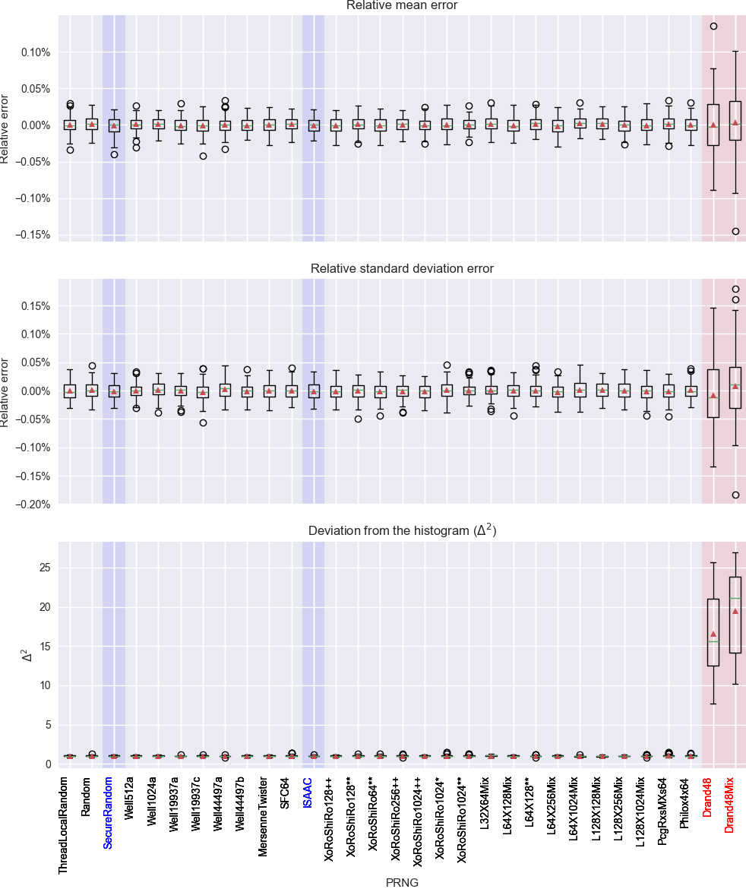

## Comparison boxplot for log-normal distribution

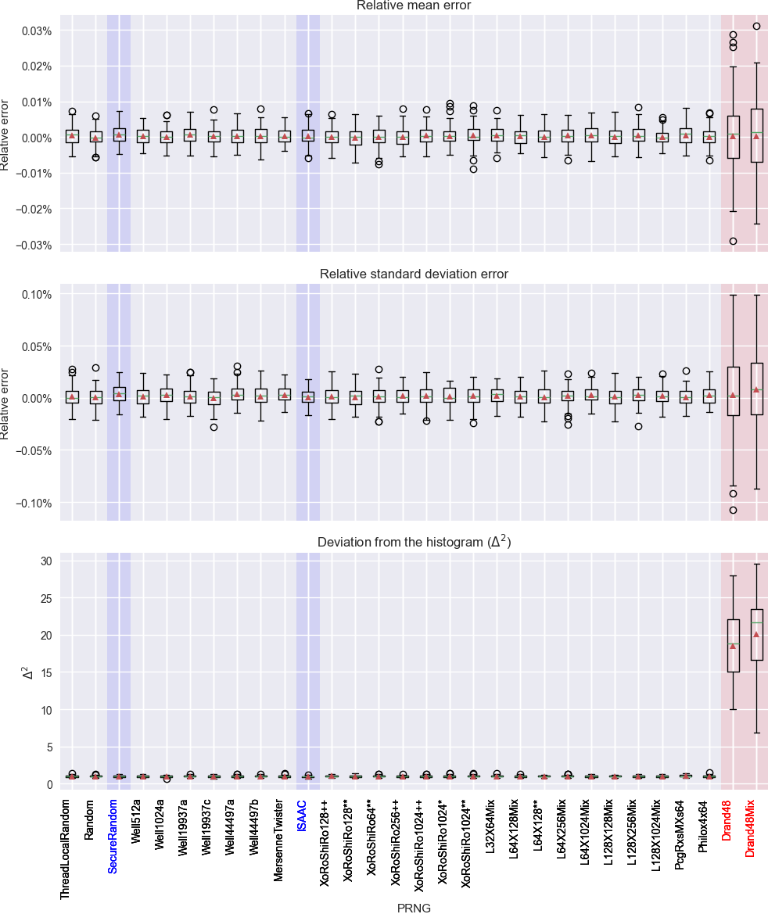

## Comparison boxplot for gamma distribution

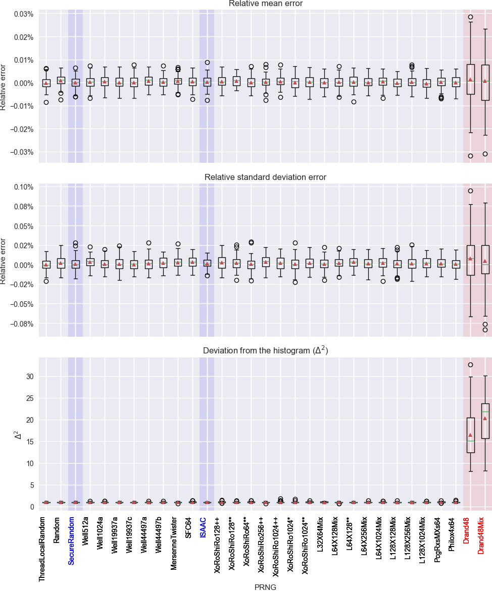

## Comparison boxplot for triangular distribution

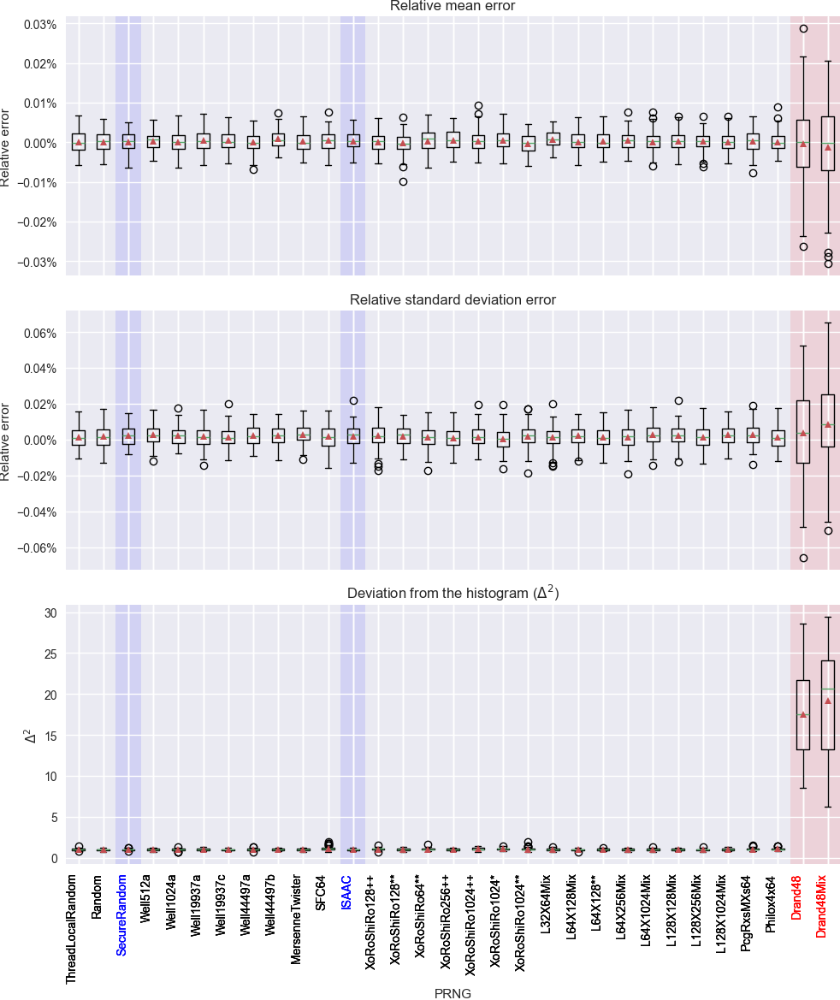

## Comparison boxplot for Poisson distribution

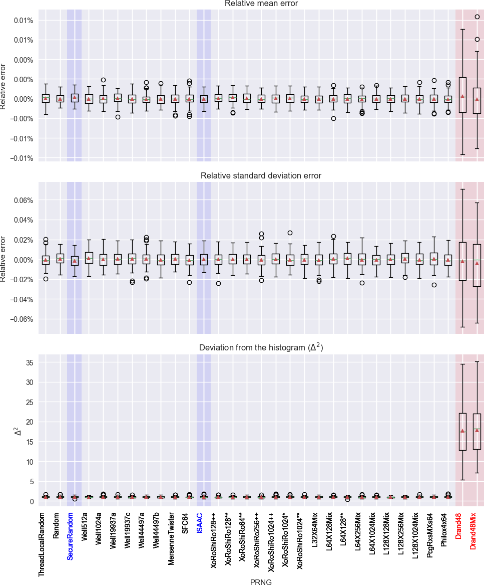

## Comparison boxplot for geometric distribution

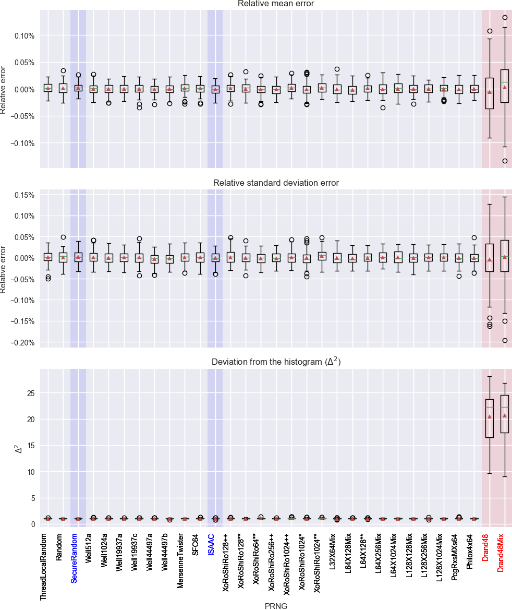

## Times needed to generate the PRN

<table id="T_ed796">
  <caption>Times to generate PRN (Normalized to fastest in each column)</caption>
  <thead>
    <tr>
      <th class="blank level0" >&nbsp;</th>
      <th id="T_ed796_level0_col0" class="col_heading level0 col0" >Exponential</th>
      <th id="T_ed796_level0_col1" class="col_heading level0 col1" >Log-Normal</th>
      <th id="T_ed796_level0_col2" class="col_heading level0 col2" >Gamma</th>
      <th id="T_ed796_level0_col3" class="col_heading level0 col3" >Triangular</th>
      <th id="T_ed796_level0_col4" class="col_heading level0 col4" >Poisson</th>
      <th id="T_ed796_level0_col5" class="col_heading level0 col5" >Geometric</th>
      <th id="T_ed796_level0_col6" class="col_heading level0 col6" >Average</th>
    </tr>
  </thead>
  <tbody>
    <tr>
      <th id="T_ed796_level0_row0" class="row_heading level0 row0" >ThreadLocalRandom</th>
      <td id="T_ed796_row0_col0" class="data row0 col0" >107%</td>
      <td id="T_ed796_row0_col1" class="data row0 col1" >100%</td>
      <td id="T_ed796_row0_col2" class="data row0 col2" >100%</td>
      <td id="T_ed796_row0_col3" class="data row0 col3" >107%</td>
      <td id="T_ed796_row0_col4" class="data row0 col4" >100%</td>
      <td id="T_ed796_row0_col5" class="data row0 col5" >103%</td>
      <td id="T_ed796_row0_col6" class="data row0 col6" >101%</td>
    </tr>
    <tr>
      <th id="T_ed796_level0_row1" class="row_heading level0 row1" >Random</th>
      <td id="T_ed796_row1_col0" class="data row1 col0" >108%</td>
      <td id="T_ed796_row1_col1" class="data row1 col1" >102%</td>
      <td id="T_ed796_row1_col2" class="data row1 col2" >104%</td>
      <td id="T_ed796_row1_col3" class="data row1 col3" >107%</td>
      <td id="T_ed796_row1_col4" class="data row1 col4" >101%</td>
      <td id="T_ed796_row1_col5" class="data row1 col5" >105%</td>
      <td id="T_ed796_row1_col6" class="data row1 col6" >103%</td>
    </tr>
    <tr>
      <th id="T_ed796_level0_row2" class="row_heading level0 row2" >SecureRandom</th>
      <td id="T_ed796_row2_col0" class="data row2 col0" >377%</td>
      <td id="T_ed796_row2_col1" class="data row2 col1" >412%</td>
      <td id="T_ed796_row2_col2" class="data row2 col2" >650%</td>
      <td id="T_ed796_row2_col3" class="data row2 col3" >370%</td>
      <td id="T_ed796_row2_col4" class="data row2 col4" >283%</td>
      <td id="T_ed796_row2_col5" class="data row2 col5" >361%</td>
      <td id="T_ed796_row2_col6" class="data row2 col6" >396%</td>
    </tr>
    <tr>
      <th id="T_ed796_level0_row3" class="row_heading level0 row3" >Well512a</th>
      <td id="T_ed796_row3_col0" class="data row3 col0" >109%</td>
      <td id="T_ed796_row3_col1" class="data row3 col1" >109%</td>
      <td id="T_ed796_row3_col2" class="data row3 col2" >117%</td>
      <td id="T_ed796_row3_col3" class="data row3 col3" >113%</td>
      <td id="T_ed796_row3_col4" class="data row3 col4" >102%</td>
      <td id="T_ed796_row3_col5" class="data row3 col5" >103%</td>
      <td id="T_ed796_row3_col6" class="data row3 col6" >107%</td>
    </tr>
    <tr>
      <th id="T_ed796_level0_row4" class="row_heading level0 row4" >Well1024a</th>
      <td id="T_ed796_row4_col0" class="data row4 col0" >109%</td>
      <td id="T_ed796_row4_col1" class="data row4 col1" >107%</td>
      <td id="T_ed796_row4_col2" class="data row4 col2" >117%</td>
      <td id="T_ed796_row4_col3" class="data row4 col3" >114%</td>
      <td id="T_ed796_row4_col4" class="data row4 col4" >102%</td>
      <td id="T_ed796_row4_col5" class="data row4 col5" >116%</td>
      <td id="T_ed796_row4_col6" class="data row4 col6" >109%</td>
    </tr>
    <tr>
      <th id="T_ed796_level0_row5" class="row_heading level0 row5" >Well19937a</th>
      <td id="T_ed796_row5_col0" class="data row5 col0" >110%</td>
      <td id="T_ed796_row5_col1" class="data row5 col1" >113%</td>
      <td id="T_ed796_row5_col2" class="data row5 col2" >123%</td>
      <td id="T_ed796_row5_col3" class="data row5 col3" >117%</td>
      <td id="T_ed796_row5_col4" class="data row5 col4" >104%</td>
      <td id="T_ed796_row5_col5" class="data row5 col5" >108%</td>
      <td id="T_ed796_row5_col6" class="data row5 col6" >111%</td>
    </tr>
    <tr>
      <th id="T_ed796_level0_row6" class="row_heading level0 row6" >Well19937c</th>
      <td id="T_ed796_row6_col0" class="data row6 col0" >111%</td>
      <td id="T_ed796_row6_col1" class="data row6 col1" >112%</td>
      <td id="T_ed796_row6_col2" class="data row6 col2" >127%</td>
      <td id="T_ed796_row6_col3" class="data row6 col3" >117%</td>
      <td id="T_ed796_row6_col4" class="data row6 col4" >106%</td>
      <td id="T_ed796_row6_col5" class="data row6 col5" >108%</td>
      <td id="T_ed796_row6_col6" class="data row6 col6" >112%</td>
    </tr>
    <tr>
      <th id="T_ed796_level0_row7" class="row_heading level0 row7" >Well44497a</th>
      <td id="T_ed796_row7_col0" class="data row7 col0" >111%</td>
      <td id="T_ed796_row7_col1" class="data row7 col1" >114%</td>
      <td id="T_ed796_row7_col2" class="data row7 col2" >125%</td>
      <td id="T_ed796_row7_col3" class="data row7 col3" >116%</td>
      <td id="T_ed796_row7_col4" class="data row7 col4" >107%</td>
      <td id="T_ed796_row7_col5" class="data row7 col5" >110%</td>
      <td id="T_ed796_row7_col6" class="data row7 col6" >112%</td>
    </tr>
    <tr>
      <th id="T_ed796_level0_row8" class="row_heading level0 row8" >Well44497b</th>
      <td id="T_ed796_row8_col0" class="data row8 col0" >113%</td>
      <td id="T_ed796_row8_col1" class="data row8 col1" >113%</td>
      <td id="T_ed796_row8_col2" class="data row8 col2" >127%</td>
      <td id="T_ed796_row8_col3" class="data row8 col3" >116%</td>
      <td id="T_ed796_row8_col4" class="data row8 col4" >106%</td>
      <td id="T_ed796_row8_col5" class="data row8 col5" >108%</td>
      <td id="T_ed796_row8_col6" class="data row8 col6" >112%</td>
    </tr>
    <tr>
      <th id="T_ed796_level0_row9" class="row_heading level0 row9" >MersenneTwister</th>
      <td id="T_ed796_row9_col0" class="data row9 col0" >108%</td>
      <td id="T_ed796_row9_col1" class="data row9 col1" >109%</td>
      <td id="T_ed796_row9_col2" class="data row9 col2" >119%</td>
      <td id="T_ed796_row9_col3" class="data row9 col3" >111%</td>
      <td id="T_ed796_row9_col4" class="data row9 col4" >105%</td>
      <td id="T_ed796_row9_col5" class="data row9 col5" >106%</td>
      <td id="T_ed796_row9_col6" class="data row9 col6" >108%</td>
    </tr>
    <tr>
      <th id="T_ed796_level0_row10" class="row_heading level0 row10" >SFC64</th>
      <td id="T_ed796_row10_col0" class="data row10 col0" >100%</td>
      <td id="T_ed796_row10_col1" class="data row10 col1" >104%</td>
      <td id="T_ed796_row10_col2" class="data row10 col2" >103%</td>
      <td id="T_ed796_row10_col3" class="data row10 col3" >100%</td>
      <td id="T_ed796_row10_col4" class="data row10 col4" >100%</td>
      <td id="T_ed796_row10_col5" class="data row10 col5" >100%</td>
      <td id="T_ed796_row10_col6" class="data row10 col6" >100%</td>
    </tr>
    <tr>
      <th id="T_ed796_level0_row11" class="row_heading level0 row11" >ISAAC</th>
      <td id="T_ed796_row11_col0" class="data row11 col0" >109%</td>
      <td id="T_ed796_row11_col1" class="data row11 col1" >108%</td>
      <td id="T_ed796_row11_col2" class="data row11 col2" >122%</td>
      <td id="T_ed796_row11_col3" class="data row11 col3" >113%</td>
      <td id="T_ed796_row11_col4" class="data row11 col4" >103%</td>
      <td id="T_ed796_row11_col5" class="data row11 col5" >107%</td>
      <td id="T_ed796_row11_col6" class="data row11 col6" >109%</td>
    </tr>
    <tr>
      <th id="T_ed796_level0_row12" class="row_heading level0 row12" >XoRoShiRo128++</th>
      <td id="T_ed796_row12_col0" class="data row12 col0" >103%</td>
      <td id="T_ed796_row12_col1" class="data row12 col1" >107%</td>
      <td id="T_ed796_row12_col2" class="data row12 col2" >112%</td>
      <td id="T_ed796_row12_col3" class="data row12 col3" >113%</td>
      <td id="T_ed796_row12_col4" class="data row12 col4" >101%</td>
      <td id="T_ed796_row12_col5" class="data row12 col5" >102%</td>
      <td id="T_ed796_row12_col6" class="data row12 col6" >105%</td>
    </tr>
    <tr>
      <th id="T_ed796_level0_row13" class="row_heading level0 row13" >XoRoShiRo128**</th>
      <td id="T_ed796_row13_col0" class="data row13 col0" >101%</td>
      <td id="T_ed796_row13_col1" class="data row13 col1" >104%</td>
      <td id="T_ed796_row13_col2" class="data row13 col2" >113%</td>
      <td id="T_ed796_row13_col3" class="data row13 col3" >110%</td>
      <td id="T_ed796_row13_col4" class="data row13 col4" >101%</td>
      <td id="T_ed796_row13_col5" class="data row13 col5" >103%</td>
      <td id="T_ed796_row13_col6" class="data row13 col6" >104%</td>
    </tr>
    <tr>
      <th id="T_ed796_level0_row14" class="row_heading level0 row14" >XoRoShiRo64**</th>
      <td id="T_ed796_row14_col0" class="data row14 col0" >101%</td>
      <td id="T_ed796_row14_col1" class="data row14 col1" >107%</td>
      <td id="T_ed796_row14_col2" class="data row14 col2" >115%</td>
      <td id="T_ed796_row14_col3" class="data row14 col3" >110%</td>
      <td id="T_ed796_row14_col4" class="data row14 col4" >100%</td>
      <td id="T_ed796_row14_col5" class="data row14 col5" >103%</td>
      <td id="T_ed796_row14_col6" class="data row14 col6" >104%</td>
    </tr>
    <tr>
      <th id="T_ed796_level0_row15" class="row_heading level0 row15" >XoRoShiRo256++</th>
      <td id="T_ed796_row15_col0" class="data row15 col0" >117%</td>
      <td id="T_ed796_row15_col1" class="data row15 col1" >121%</td>
      <td id="T_ed796_row15_col2" class="data row15 col2" >122%</td>
      <td id="T_ed796_row15_col3" class="data row15 col3" >122%</td>
      <td id="T_ed796_row15_col4" class="data row15 col4" >108%</td>
      <td id="T_ed796_row15_col5" class="data row15 col5" >117%</td>
      <td id="T_ed796_row15_col6" class="data row15 col6" >116%</td>
    </tr>
    <tr>
      <th id="T_ed796_level0_row16" class="row_heading level0 row16" >XoRoShiRo1024++</th>
      <td id="T_ed796_row16_col0" class="data row16 col0" >104%</td>
      <td id="T_ed796_row16_col1" class="data row16 col1" >109%</td>
      <td id="T_ed796_row16_col2" class="data row16 col2" >107%</td>
      <td id="T_ed796_row16_col3" class="data row16 col3" >104%</td>
      <td id="T_ed796_row16_col4" class="data row16 col4" >102%</td>
      <td id="T_ed796_row16_col5" class="data row16 col5" >101%</td>
      <td id="T_ed796_row16_col6" class="data row16 col6" >103%</td>
    </tr>
    <tr>
      <th id="T_ed796_level0_row17" class="row_heading level0 row17" >XoRoShiRo1024*</th>
      <td id="T_ed796_row17_col0" class="data row17 col0" >107%</td>
      <td id="T_ed796_row17_col1" class="data row17 col1" >109%</td>
      <td id="T_ed796_row17_col2" class="data row17 col2" >108%</td>
      <td id="T_ed796_row17_col3" class="data row17 col3" >105%</td>
      <td id="T_ed796_row17_col4" class="data row17 col4" >103%</td>
      <td id="T_ed796_row17_col5" class="data row17 col5" >101%</td>
      <td id="T_ed796_row17_col6" class="data row17 col6" >104%</td>
    </tr>
    <tr>
      <th id="T_ed796_level0_row18" class="row_heading level0 row18" >XoRoShiRo1024**</th>
      <td id="T_ed796_row18_col0" class="data row18 col0" >108%</td>
      <td id="T_ed796_row18_col1" class="data row18 col1" >110%</td>
      <td id="T_ed796_row18_col2" class="data row18 col2" >109%</td>
      <td id="T_ed796_row18_col3" class="data row18 col3" >106%</td>
      <td id="T_ed796_row18_col4" class="data row18 col4" >102%</td>
      <td id="T_ed796_row18_col5" class="data row18 col5" >104%</td>
      <td id="T_ed796_row18_col6" class="data row18 col6" >105%</td>
    </tr>
    <tr>
      <th id="T_ed796_level0_row19" class="row_heading level0 row19" >L32X64Mix</th>
      <td id="T_ed796_row19_col0" class="data row19 col0" >105%</td>
      <td id="T_ed796_row19_col1" class="data row19 col1" >105%</td>
      <td id="T_ed796_row19_col2" class="data row19 col2" >114%</td>
      <td id="T_ed796_row19_col3" class="data row19 col3" >110%</td>
      <td id="T_ed796_row19_col4" class="data row19 col4" >102%</td>
      <td id="T_ed796_row19_col5" class="data row19 col5" >104%</td>
      <td id="T_ed796_row19_col6" class="data row19 col6" >105%</td>
    </tr>
    <tr>
      <th id="T_ed796_level0_row20" class="row_heading level0 row20" >L64X128Mix</th>
      <td id="T_ed796_row20_col0" class="data row20 col0" >119%</td>
      <td id="T_ed796_row20_col1" class="data row20 col1" >123%</td>
      <td id="T_ed796_row20_col2" class="data row20 col2" >124%</td>
      <td id="T_ed796_row20_col3" class="data row20 col3" >123%</td>
      <td id="T_ed796_row20_col4" class="data row20 col4" >109%</td>
      <td id="T_ed796_row20_col5" class="data row20 col5" >116%</td>
      <td id="T_ed796_row20_col6" class="data row20 col6" >117%</td>
    </tr>
    <tr>
      <th id="T_ed796_level0_row21" class="row_heading level0 row21" >L64X128**</th>
      <td id="T_ed796_row21_col0" class="data row21 col0" >123%</td>
      <td id="T_ed796_row21_col1" class="data row21 col1" >122%</td>
      <td id="T_ed796_row21_col2" class="data row21 col2" >126%</td>
      <td id="T_ed796_row21_col3" class="data row21 col3" >122%</td>
      <td id="T_ed796_row21_col4" class="data row21 col4" >111%</td>
      <td id="T_ed796_row21_col5" class="data row21 col5" >117%</td>
      <td id="T_ed796_row21_col6" class="data row21 col6" >118%</td>
    </tr>
    <tr>
      <th id="T_ed796_level0_row22" class="row_heading level0 row22" >L64X256Mix</th>
      <td id="T_ed796_row22_col0" class="data row22 col0" >125%</td>
      <td id="T_ed796_row22_col1" class="data row22 col1" >123%</td>
      <td id="T_ed796_row22_col2" class="data row22 col2" >127%</td>
      <td id="T_ed796_row22_col3" class="data row22 col3" >123%</td>
      <td id="T_ed796_row22_col4" class="data row22 col4" >112%</td>
      <td id="T_ed796_row22_col5" class="data row22 col5" >119%</td>
      <td id="T_ed796_row22_col6" class="data row22 col6" >119%</td>
    </tr>
    <tr>
      <th id="T_ed796_level0_row23" class="row_heading level0 row23" >L64X1024Mix</th>
      <td id="T_ed796_row23_col0" class="data row23 col0" >127%</td>
      <td id="T_ed796_row23_col1" class="data row23 col1" >124%</td>
      <td id="T_ed796_row23_col2" class="data row23 col2" >128%</td>
      <td id="T_ed796_row23_col3" class="data row23 col3" >124%</td>
      <td id="T_ed796_row23_col4" class="data row23 col4" >112%</td>
      <td id="T_ed796_row23_col5" class="data row23 col5" >119%</td>
      <td id="T_ed796_row23_col6" class="data row23 col6" >120%</td>
    </tr>
    <tr>
      <th id="T_ed796_level0_row24" class="row_heading level0 row24" >L128X128Mix</th>
      <td id="T_ed796_row24_col0" class="data row24 col0" >124%</td>
      <td id="T_ed796_row24_col1" class="data row24 col1" >124%</td>
      <td id="T_ed796_row24_col2" class="data row24 col2" >128%</td>
      <td id="T_ed796_row24_col3" class="data row24 col3" >126%</td>
      <td id="T_ed796_row24_col4" class="data row24 col4" >112%</td>
      <td id="T_ed796_row24_col5" class="data row24 col5" >119%</td>
      <td id="T_ed796_row24_col6" class="data row24 col6" >120%</td>
    </tr>
    <tr>
      <th id="T_ed796_level0_row25" class="row_heading level0 row25" >L128X256Mix</th>
      <td id="T_ed796_row25_col0" class="data row25 col0" >122%</td>
      <td id="T_ed796_row25_col1" class="data row25 col1" >123%</td>
      <td id="T_ed796_row25_col2" class="data row25 col2" >128%</td>
      <td id="T_ed796_row25_col3" class="data row25 col3" >126%</td>
      <td id="T_ed796_row25_col4" class="data row25 col4" >113%</td>
      <td id="T_ed796_row25_col5" class="data row25 col5" >120%</td>
      <td id="T_ed796_row25_col6" class="data row25 col6" >120%</td>
    </tr>
    <tr>
      <th id="T_ed796_level0_row26" class="row_heading level0 row26" >L128X1024Mix</th>
      <td id="T_ed796_row26_col0" class="data row26 col0" >124%</td>
      <td id="T_ed796_row26_col1" class="data row26 col1" >124%</td>
      <td id="T_ed796_row26_col2" class="data row26 col2" >129%</td>
      <td id="T_ed796_row26_col3" class="data row26 col3" >126%</td>
      <td id="T_ed796_row26_col4" class="data row26 col4" >112%</td>
      <td id="T_ed796_row26_col5" class="data row26 col5" >121%</td>
      <td id="T_ed796_row26_col6" class="data row26 col6" >120%</td>
    </tr>
    <tr>
      <th id="T_ed796_level0_row27" class="row_heading level0 row27" >PcgRxsMXs64</th>
      <td id="T_ed796_row27_col0" class="data row27 col0" >108%</td>
      <td id="T_ed796_row27_col1" class="data row27 col1" >110%</td>
      <td id="T_ed796_row27_col2" class="data row27 col2" >109%</td>
      <td id="T_ed796_row27_col3" class="data row27 col3" >106%</td>
      <td id="T_ed796_row27_col4" class="data row27 col4" >103%</td>
      <td id="T_ed796_row27_col5" class="data row27 col5" >102%</td>
      <td id="T_ed796_row27_col6" class="data row27 col6" >105%</td>
    </tr>
    <tr>
      <th id="T_ed796_level0_row28" class="row_heading level0 row28" >Philox4x64</th>
      <td id="T_ed796_row28_col0" class="data row28 col0" >110%</td>
      <td id="T_ed796_row28_col1" class="data row28 col1" >114%</td>
      <td id="T_ed796_row28_col2" class="data row28 col2" >111%</td>
      <td id="T_ed796_row28_col3" class="data row28 col3" >108%</td>
      <td id="T_ed796_row28_col4" class="data row28 col4" >104%</td>
      <td id="T_ed796_row28_col5" class="data row28 col5" >106%</td>
      <td id="T_ed796_row28_col6" class="data row28 col6" >107%</td>
    </tr>
    <tr>
      <th id="T_ed796_level0_row29" class="row_heading level0 row29" >Drand48</th>
      <td id="T_ed796_row29_col0" class="data row29 col0" >101%</td>
      <td id="T_ed796_row29_col1" class="data row29 col1" >105%</td>
      <td id="T_ed796_row29_col2" class="data row29 col2" >109%</td>
      <td id="T_ed796_row29_col3" class="data row29 col3" >108%</td>
      <td id="T_ed796_row29_col4" class="data row29 col4" >102%</td>
      <td id="T_ed796_row29_col5" class="data row29 col5" >101%</td>
      <td id="T_ed796_row29_col6" class="data row29 col6" >103%</td>
    </tr>
    <tr>
      <th id="T_ed796_level0_row30" class="row_heading level0 row30" >Drand48Mix</th>
      <td id="T_ed796_row30_col0" class="data row30 col0" >110%</td>
      <td id="T_ed796_row30_col1" class="data row30 col1" >112%</td>
      <td id="T_ed796_row30_col2" class="data row30 col2" >116%</td>
      <td id="T_ed796_row30_col3" class="data row30 col3" >115%</td>
      <td id="T_ed796_row30_col4" class="data row30 col4" >100%</td>
      <td id="T_ed796_row30_col5" class="data row30 col5" >100%</td>
      <td id="T_ed796_row30_col6" class="data row30 col6" >107%</td>
    </tr>
    <tr>
      <th id="T_ed796_level0_row31" class="row_heading level0 row31" >ThreadLocalRandomSlow</th>
      <td id="T_ed796_row31_col0" class="data row31 col0" >112%</td>
      <td id="T_ed796_row31_col1" class="data row31 col1" >115%</td>
      <td id="T_ed796_row31_col2" class="data row31 col2" >111%</td>
      <td id="T_ed796_row31_col3" class="data row31 col3" >112%</td>
      <td id="T_ed796_row31_col4" class="data row31 col4" >104%</td>
      <td id="T_ed796_row31_col5" class="data row31 col5" >102%</td>
      <td id="T_ed796_row31_col6" class="data row31 col6" >108%</td>
    </tr>
  </tbody>
</table>

(Values are column-wise normalized to the fasted generator, i.e. the fastest generator in each column has the value 100%.)

The generators XoRoShiRo256++, L64X128Mix, L64X128**, L64X256Mix, L64X1024Mix, L128X128Mix, L128X256Mix and L128X1024Mix are linked via reflection. Therefore they are a bit slower than the other generators of the same families.

## Platform comparison AMD Ryzen 9 3900XT (x86-64), Windows 11 (25H2) to Raspberry Pi 4 (ARMv8)

The following charts shows the speed ranking of the different PRNGs on x86-64 and ARMv8 platform. The generators marked with (*) are linked via reflection. The generator marked with (**) is ThreadLocalRandom but using the thread-local map on each call.

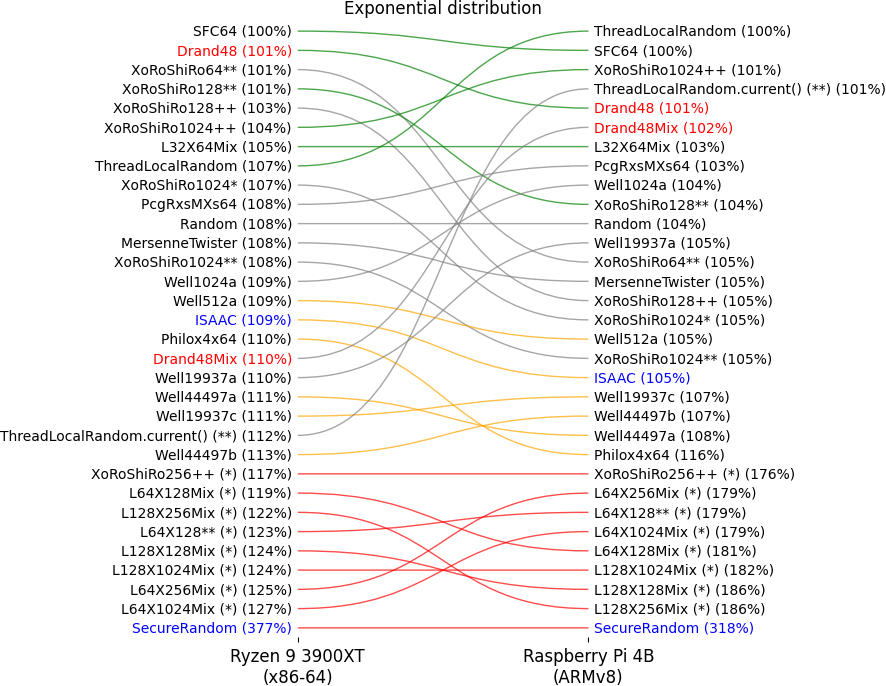

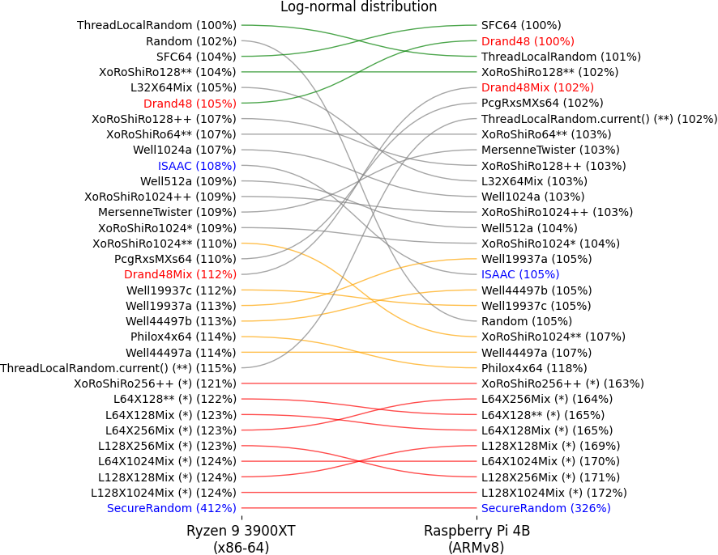

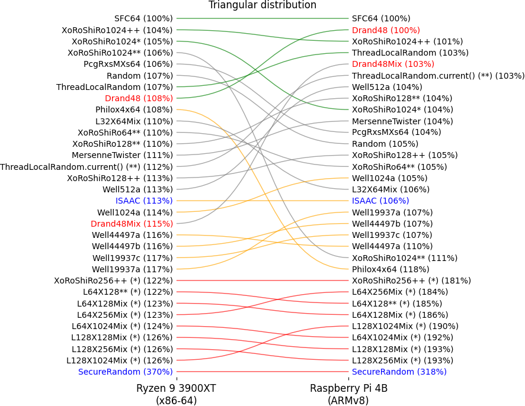

## Platform comparison AMD Ryzen 9 3900XT (x86-64), Windows 11 (25H2) to Intel Core Ultra 5 225H (x86-64), Kubuntu 26.04

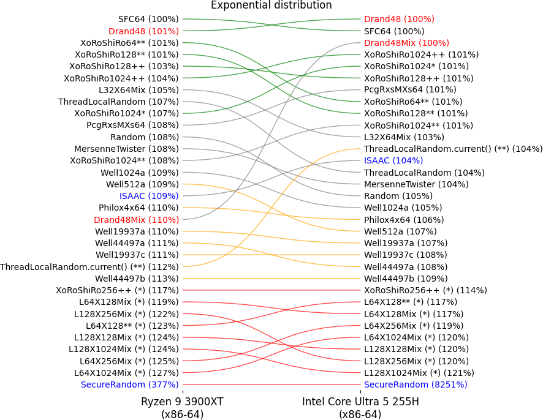

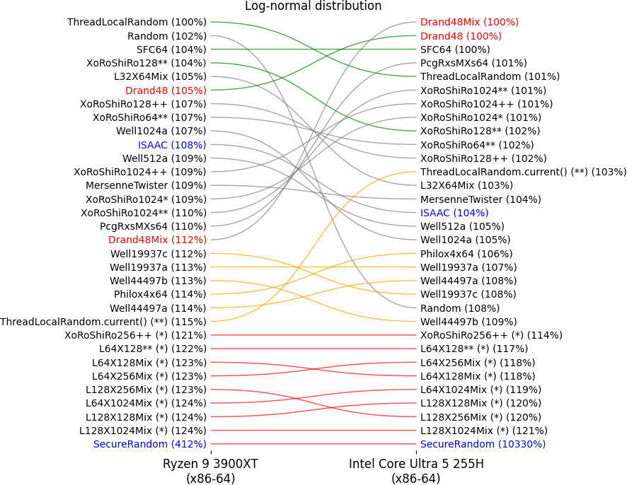

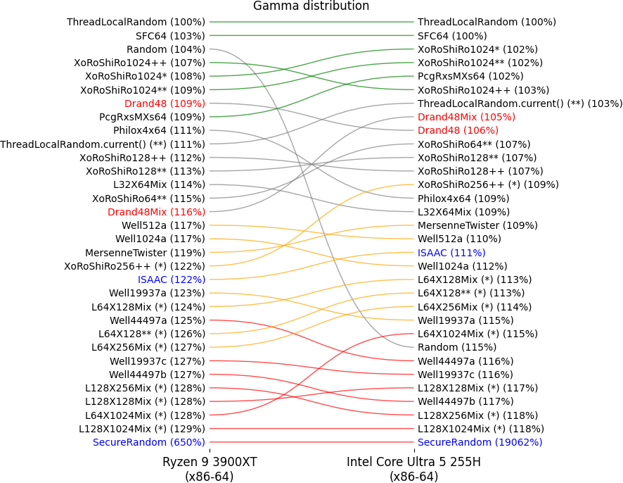

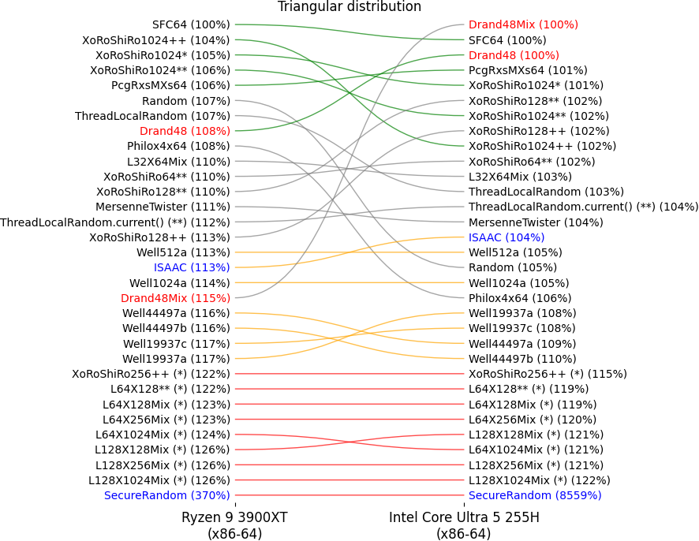

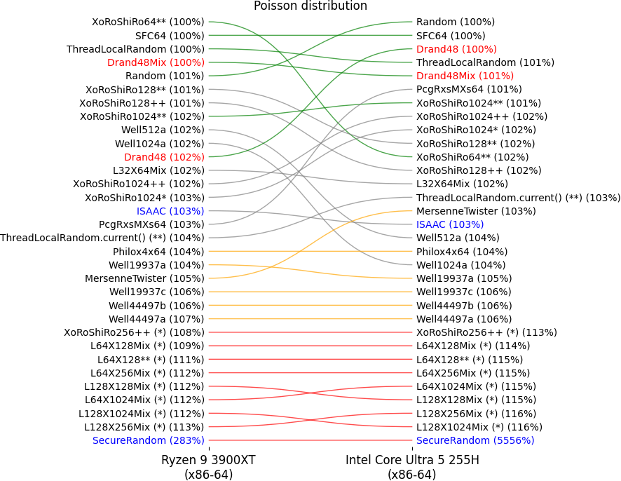

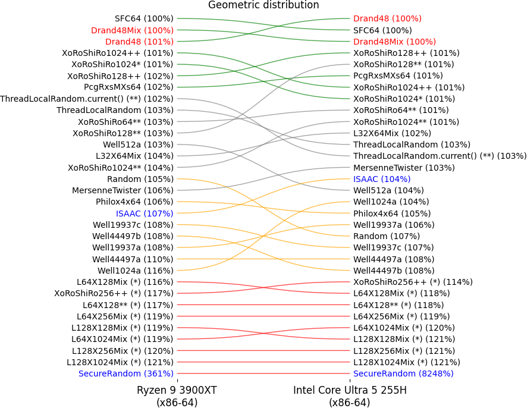

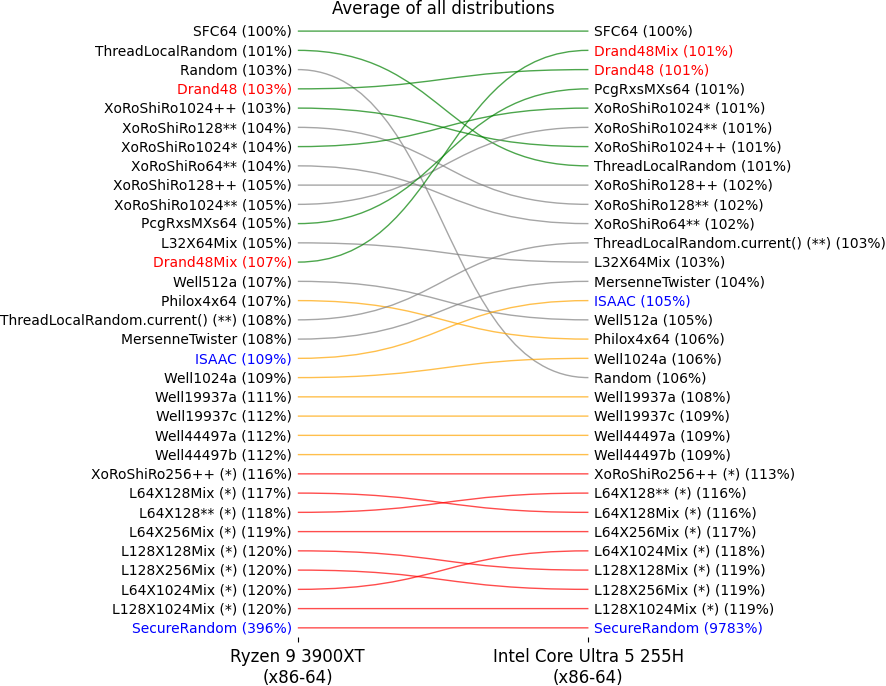

## Autocorrelations

### Boxplots of the autocorrelation at lag 1 of the PRN of the different pseudorandom number generator

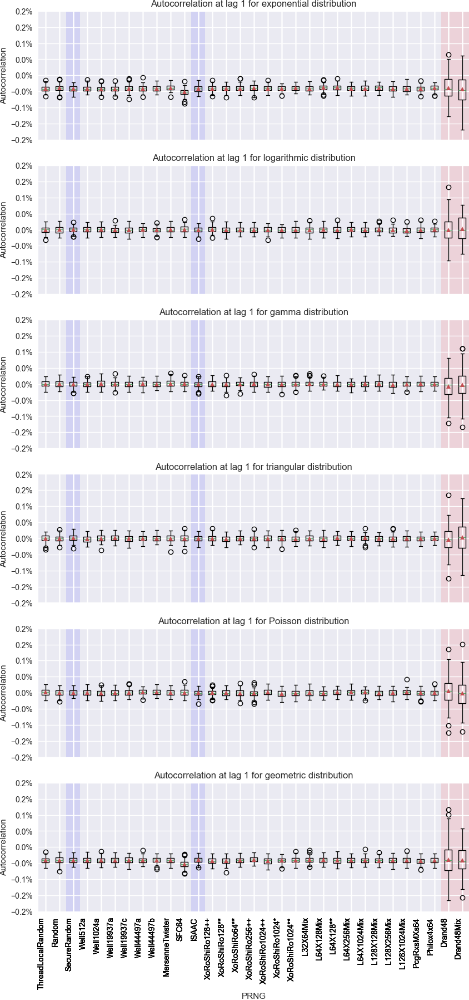

### Boxplots of the autocorrelation at lag 2 of the PRN of the different pseudorandom number generator

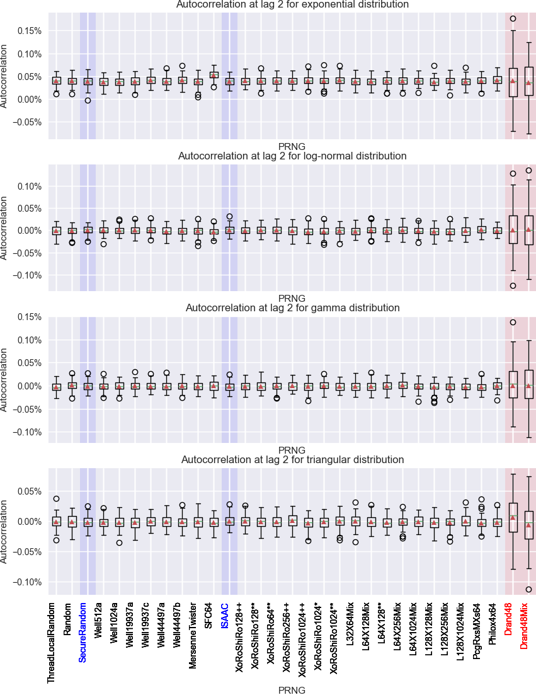

### Boxplots of the autocorrelation at lag 3 of the PRN of the different pseudorandom number generator

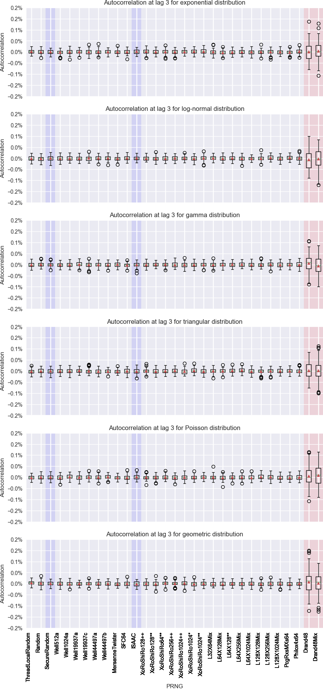

### Boxplots of the absolute sum of the autocorrelation at lags 1 to 100 of the PRN of the different pseudorandom number generators

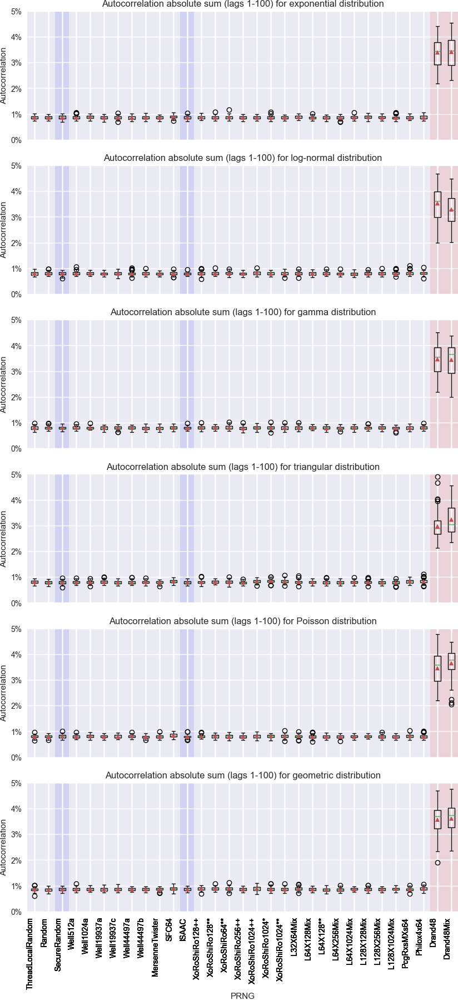

## Raw result data

Raw data from the simulations as tabulator separated text files:

* [Exponential distribution](statistics/results1Exp.txt)
* [Log-normal distribution](statistics/results1Log.txt)
* [Gamma distribution](statistics/results1Gamma.txt)
* [Triangular distribution](statistics/results1Triangular.txt)
* [Poisson distribution](statistics/results1Poisson.txt)
* [Geometric distribution](statistics/results1Geometric.txt)

Raw data from the simulations on the Raspberry Pi as tabulator separated text files:

* [Exponential distribution](statistics/results1Exp-raspberrypi.txt)
* [Log-Normal distribution](statistics/results1Log-raspberrypi.txt)
* [Triangular distribution](statistics/results1Triangular-raspberrypi.txt)

Raw data from the simulations on the Intel Core Ultra 5 225H as tabulator separated text files:

* [Exponential distribution](statistics/results1Exp-intel.txt)
* [Log-Normal distribution](statistics/results1Log-intel.txt)
* [Gamma distribution](statistics/results1Gamma-intel.txt)
* [Triangular distribution](statistics/results1Triangular-intel.txt)
* [Poisson distribution](statistics/results1Poisson-intel.txt)
* [Geometric distribution](statistics/results1Geometric-intel.txt)

Raw data from the simulations for the autocorrelations as tabulator separated text files:

* [Exponential distribution](statistics/results1ExpAutokorrelation.txt)
* [Log-normal distribution](statistics/results1LogAutokorrelation.txt)
* [Gamma distribution](statistics/results1GammaAutokorrelation.txt)
* [Triangular distribution](statistics/results1TriangularAutokorrelation.txt)
* [Poisson distribution](statistics/results1PoissonAutocorrelation.txt)
* [Geometric distribution](statistics/results1GeometricAutocorrelation.txt)
*