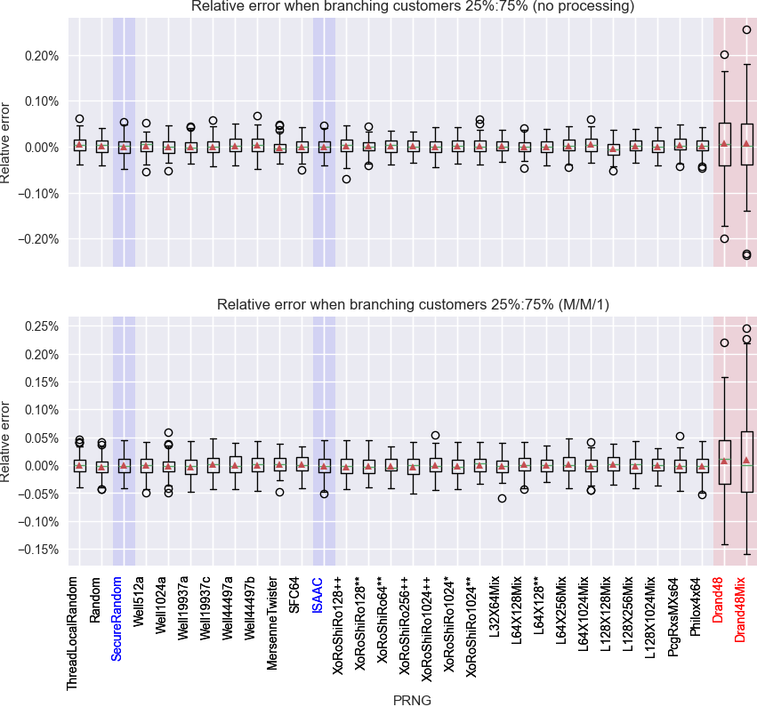
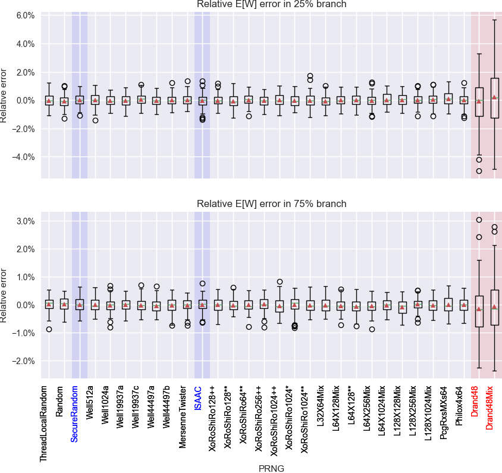

# Queueing models with branching

The following 31 pseudorandom numbers generators (PRNG) have been tested to generate pseudorandom numbers (PRN) for a queueing model with branching with and without M/M/1 processing.

* ThreadLocalRandom
* Random
* SecureRandom
* Well512a
* Well1024a
* Well19937a
* Well19937c
* Well44497a
* Well44497b
* MersenneTwister
* SFC64
* ISAAC
* XoRoShiRo128++
* XoRoShiRo128**
* XoRoShiRo64**
* XoRoShiRo256++
* XoRoShiRo1024++
* XoRoShiRo1024*
* XoRoShiRo1024**
* L32X64Mix
* L64X128Mix
* L64X128
* L64X256Mix
* L64X1024Mix
* L128X128Mix
* L128X256Mix
* L128X1024Mix
* PcgRxsMXs64
* Philox4x64
* Drand48
* Drand48Mix

## Simulation results

Relative error between theorerical split (25%:75%) and actual branching based on the PRN:

Relative errors in E[W] in the model with M/M/1 proceeding after the branching:

## Model files

The simulation was based on these Warteschlangensimulator model files:

* [Branching 25%:75%](models/model3a.xml)
* [Branching 25%:75% and M/M/1 processing](models/model3b.xml)

## Raw result data

Raw data from the simulations as tabulator separated text files:

* [Branching 25%:75%](statistics/results3a.xml)
* [Branching 25%:75% and M/M/1 processing](statistics/results3b.xml)
