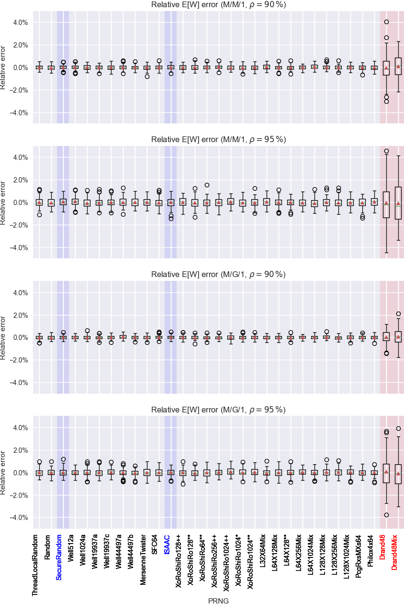

# Queueing models

The following 31 pseudorandom numbers generators (PRNG) have been tested to generate pseudorandom numbers (PRN) for a M/M/1 and a M/G/1 queueing model each with an utilization of $\rho=90\,\%$ and $\rho=95\,\%$. In the M/G/1 case, the service time distribution is a log-normal distribution.

* ThreadLocalRandom
* Random
* SecureRandom
* Well512a
* Well1024a
* Well19937a
* Well19937c
* Well44497a
* Well44497b
* MersenneTwister
* ISAAC
* XoRoShiRo128++
* XoRoShiRo128**
* XoRoShiRo64**
* XoRoShiRo256++
* XoRoShiRo1024++
* XoRoShiRo1024*
* XoRoShiRo1024**
* L32X64Mix
* L64X128Mix
* L64X128
* L64X256Mix
* L64X1024Mix
* L128X128Mix
* L128X256Mix
* L128X1024Mix
* PcgRxsMXs64
* Philox4x64
* Drand48
* Drand48Mix

## Simulations results

### M/M/1 and M/G/1 - $\rho=90\,\%$

<table id="T_82e26">
  <caption>Mean Error (in \%)</caption>
  <thead>
    <tr>
      <th class="blank level0" >&nbsp;</th>
      <th id="T_82e26_level0_col0" class="col_heading level0 col0" >E[W] - MM1</th>
      <th id="T_82e26_level0_col1" class="col_heading level0 col1" >E[V] - MM1</th>
      <th id="T_82e26_level0_col2" class="col_heading level0 col2" >E[W] - MG1</th>
      <th id="T_82e26_level0_col3" class="col_heading level0 col3" >E[V] - MG1</th>
    </tr>
  </thead>
  <tbody>
    <tr>
      <th id="T_82e26_level0_row0" class="row_heading level0 row0" >ThreadLocalRandom</th>
      <td id="T_82e26_row0_col0" class="data row0 col0" >0.014%</td>
      <td id="T_82e26_row0_col1" class="data row0 col1" >0.013%</td>
      <td id="T_82e26_row0_col2" class="data row0 col2" >0.008%</td>
      <td id="T_82e26_row0_col3" class="data row0 col3" >0.007%</td>
    </tr>
    <tr>
      <th id="T_82e26_level0_row1" class="row_heading level0 row1" >Random</th>
      <td id="T_82e26_row1_col0" class="data row1 col0" >0.021%</td>
      <td id="T_82e26_row1_col1" class="data row1 col1" >0.019%</td>
      <td id="T_82e26_row1_col2" class="data row1 col2" >0.026%</td>
      <td id="T_82e26_row1_col3" class="data row1 col3" >0.022%</td>
    </tr>
    <tr>
      <th id="T_82e26_level0_row2" class="row_heading level0 row2" >SecureRandom</th>
      <td id="T_82e26_row2_col0" class="data row2 col0" >0.012%</td>
      <td id="T_82e26_row2_col1" class="data row2 col1" >0.011%</td>
      <td id="T_82e26_row2_col2" class="data row2 col2" >0.018%</td>
      <td id="T_82e26_row2_col3" class="data row2 col3" >0.016%</td>
    </tr>
    <tr>
      <th id="T_82e26_level0_row3" class="row_heading level0 row3" >Well512a</th>
      <td id="T_82e26_row3_col0" class="data row3 col0" >0.006%</td>
      <td id="T_82e26_row3_col1" class="data row3 col1" >0.005%</td>
      <td id="T_82e26_row3_col2" class="data row3 col2" >0.002%</td>
      <td id="T_82e26_row3_col3" class="data row3 col3" >0.001%</td>
    </tr>
    <tr>
      <th id="T_82e26_level0_row4" class="row_heading level0 row4" >Well1024a</th>
      <td id="T_82e26_row4_col0" class="data row4 col0" >0.002%</td>
      <td id="T_82e26_row4_col1" class="data row4 col1" >0.002%</td>
      <td id="T_82e26_row4_col2" class="data row4 col2" >0.009%</td>
      <td id="T_82e26_row4_col3" class="data row4 col3" >0.008%</td>
    </tr>
    <tr>
      <th id="T_82e26_level0_row5" class="row_heading level0 row5" >Well19937a</th>
      <td id="T_82e26_row5_col0" class="data row5 col0" >0.006%</td>
      <td id="T_82e26_row5_col1" class="data row5 col1" >0.005%</td>
      <td id="T_82e26_row5_col2" class="data row5 col2" >0.024%</td>
      <td id="T_82e26_row5_col3" class="data row5 col3" >0.021%</td>
    </tr>
    <tr>
      <th id="T_82e26_level0_row6" class="row_heading level0 row6" >Well19937c</th>
      <td id="T_82e26_row6_col0" class="data row6 col0" >0.003%</td>
      <td id="T_82e26_row6_col1" class="data row6 col1" >0.003%</td>
      <td id="T_82e26_row6_col2" class="data row6 col2" >0.012%</td>
      <td id="T_82e26_row6_col3" class="data row6 col3" >0.010%</td>
    </tr>
    <tr>
      <th id="T_82e26_level0_row7" class="row_heading level0 row7" >Well44497a</th>
      <td id="T_82e26_row7_col0" class="data row7 col0" >0.005%</td>
      <td id="T_82e26_row7_col1" class="data row7 col1" >0.005%</td>
      <td id="T_82e26_row7_col2" class="data row7 col2" >0.048%</td>
      <td id="T_82e26_row7_col3" class="data row7 col3" >0.041%</td>
    </tr>
    <tr>
      <th id="T_82e26_level0_row8" class="row_heading level0 row8" >Well44497b</th>
      <td id="T_82e26_row8_col0" class="data row8 col0" >0.009%</td>
      <td id="T_82e26_row8_col1" class="data row8 col1" >0.008%</td>
      <td id="T_82e26_row8_col2" class="data row8 col2" >0.010%</td>
      <td id="T_82e26_row8_col3" class="data row8 col3" >0.009%</td>
    </tr>
    <tr>
      <th id="T_82e26_level0_row9" class="row_heading level0 row9" >MersenneTwister</th>
      <td id="T_82e26_row9_col0" class="data row9 col0" >0.019%</td>
      <td id="T_82e26_row9_col1" class="data row9 col1" >0.017%</td>
      <td id="T_82e26_row9_col2" class="data row9 col2" >0.002%</td>
      <td id="T_82e26_row9_col3" class="data row9 col3" >0.001%</td>
    </tr>
    <tr>
      <th id="T_82e26_level0_row10" class="row_heading level0 row10" >ISAAC</th>
      <td id="T_82e26_row10_col0" class="data row10 col0" >0.022%</td>
      <td id="T_82e26_row10_col1" class="data row10 col1" >0.020%</td>
      <td id="T_82e26_row10_col2" class="data row10 col2" >0.030%</td>
      <td id="T_82e26_row10_col3" class="data row10 col3" >0.026%</td>
    </tr>
    <tr>
      <th id="T_82e26_level0_row11" class="row_heading level0 row11" >XoRoShiRo128++</th>
      <td id="T_82e26_row11_col0" class="data row11 col0" >0.004%</td>
      <td id="T_82e26_row11_col1" class="data row11 col1" >0.004%</td>
      <td id="T_82e26_row11_col2" class="data row11 col2" >0.008%</td>
      <td id="T_82e26_row11_col3" class="data row11 col3" >0.007%</td>
    </tr>
    <tr>
      <th id="T_82e26_level0_row12" class="row_heading level0 row12" >XoRoShiRo128**</th>
      <td id="T_82e26_row12_col0" class="data row12 col0" >0.009%</td>
      <td id="T_82e26_row12_col1" class="data row12 col1" >0.008%</td>
      <td id="T_82e26_row12_col2" class="data row12 col2" >0.007%</td>
      <td id="T_82e26_row12_col3" class="data row12 col3" >0.006%</td>
    </tr>
    <tr>
      <th id="T_82e26_level0_row13" class="row_heading level0 row13" >XoRoShiRo64**</th>
      <td id="T_82e26_row13_col0" class="data row13 col0" >0.011%</td>
      <td id="T_82e26_row13_col1" class="data row13 col1" >0.010%</td>
      <td id="T_82e26_row13_col2" class="data row13 col2" >0.012%</td>
      <td id="T_82e26_row13_col3" class="data row13 col3" >0.011%</td>
    </tr>
    <tr>
      <th id="T_82e26_level0_row14" class="row_heading level0 row14" >XoRoShiRo256++</th>
      <td id="T_82e26_row14_col0" class="data row14 col0" >0.026%</td>
      <td id="T_82e26_row14_col1" class="data row14 col1" >0.023%</td>
      <td id="T_82e26_row14_col2" class="data row14 col2" >0.005%</td>
      <td id="T_82e26_row14_col3" class="data row14 col3" >0.004%</td>
    </tr>
    <tr>
      <th id="T_82e26_level0_row15" class="row_heading level0 row15" >XoRoShiRo1024++</th>
      <td id="T_82e26_row15_col0" class="data row15 col0" >0.027%</td>
      <td id="T_82e26_row15_col1" class="data row15 col1" >0.025%</td>
      <td id="T_82e26_row15_col2" class="data row15 col2" >0.000%</td>
      <td id="T_82e26_row15_col3" class="data row15 col3" >0.000%</td>
    </tr>
    <tr>
      <th id="T_82e26_level0_row16" class="row_heading level0 row16" >XoRoShiRo1024*</th>
      <td id="T_82e26_row16_col0" class="data row16 col0" >0.026%</td>
      <td id="T_82e26_row16_col1" class="data row16 col1" >0.023%</td>
      <td id="T_82e26_row16_col2" class="data row16 col2" >0.005%</td>
      <td id="T_82e26_row16_col3" class="data row16 col3" >0.004%</td>
    </tr>
    <tr>
      <th id="T_82e26_level0_row17" class="row_heading level0 row17" >XoRoShiRo1024**</th>
      <td id="T_82e26_row17_col0" class="data row17 col0" >0.015%</td>
      <td id="T_82e26_row17_col1" class="data row17 col1" >0.013%</td>
      <td id="T_82e26_row17_col2" class="data row17 col2" >0.005%</td>
      <td id="T_82e26_row17_col3" class="data row17 col3" >0.004%</td>
    </tr>
    <tr>
      <th id="T_82e26_level0_row18" class="row_heading level0 row18" >L32X64Mix</th>
      <td id="T_82e26_row18_col0" class="data row18 col0" >0.046%</td>
      <td id="T_82e26_row18_col1" class="data row18 col1" >0.042%</td>
      <td id="T_82e26_row18_col2" class="data row18 col2" >0.010%</td>
      <td id="T_82e26_row18_col3" class="data row18 col3" >0.008%</td>
    </tr>
    <tr>
      <th id="T_82e26_level0_row19" class="row_heading level0 row19" >L64X128Mix</th>
      <td id="T_82e26_row19_col0" class="data row19 col0" >0.002%</td>
      <td id="T_82e26_row19_col1" class="data row19 col1" >0.002%</td>
      <td id="T_82e26_row19_col2" class="data row19 col2" >0.006%</td>
      <td id="T_82e26_row19_col3" class="data row19 col3" >0.005%</td>
    </tr>
    <tr>
      <th id="T_82e26_level0_row20" class="row_heading level0 row20" >L64X128**</th>
      <td id="T_82e26_row20_col0" class="data row20 col0" >0.013%</td>
      <td id="T_82e26_row20_col1" class="data row20 col1" >0.012%</td>
      <td id="T_82e26_row20_col2" class="data row20 col2" >0.005%</td>
      <td id="T_82e26_row20_col3" class="data row20 col3" >0.004%</td>
    </tr>
    <tr>
      <th id="T_82e26_level0_row21" class="row_heading level0 row21" >L64X256Mix</th>
      <td id="T_82e26_row21_col0" class="data row21 col0" >0.020%</td>
      <td id="T_82e26_row21_col1" class="data row21 col1" >0.018%</td>
      <td id="T_82e26_row21_col2" class="data row21 col2" >0.002%</td>
      <td id="T_82e26_row21_col3" class="data row21 col3" >0.002%</td>
    </tr>
    <tr>
      <th id="T_82e26_level0_row22" class="row_heading level0 row22" >L64X1024Mix</th>
      <td id="T_82e26_row22_col0" class="data row22 col0" >0.046%</td>
      <td id="T_82e26_row22_col1" class="data row22 col1" >0.041%</td>
      <td id="T_82e26_row22_col2" class="data row22 col2" >0.009%</td>
      <td id="T_82e26_row22_col3" class="data row22 col3" >0.008%</td>
    </tr>
    <tr>
      <th id="T_82e26_level0_row23" class="row_heading level0 row23" >L128X128Mix</th>
      <td id="T_82e26_row23_col0" class="data row23 col0" >0.017%</td>
      <td id="T_82e26_row23_col1" class="data row23 col1" >0.015%</td>
      <td id="T_82e26_row23_col2" class="data row23 col2" >0.033%</td>
      <td id="T_82e26_row23_col3" class="data row23 col3" >0.028%</td>
    </tr>
    <tr>
      <th id="T_82e26_level0_row24" class="row_heading level0 row24" >L128X256Mix</th>
      <td id="T_82e26_row24_col0" class="data row24 col0" >0.007%</td>
      <td id="T_82e26_row24_col1" class="data row24 col1" >0.006%</td>
      <td id="T_82e26_row24_col2" class="data row24 col2" >0.013%</td>
      <td id="T_82e26_row24_col3" class="data row24 col3" >0.011%</td>
    </tr>
    <tr>
      <th id="T_82e26_level0_row25" class="row_heading level0 row25" >L128X1024Mix</th>
      <td id="T_82e26_row25_col0" class="data row25 col0" >0.018%</td>
      <td id="T_82e26_row25_col1" class="data row25 col1" >0.016%</td>
      <td id="T_82e26_row25_col2" class="data row25 col2" >0.016%</td>
      <td id="T_82e26_row25_col3" class="data row25 col3" >0.014%</td>
    </tr>
    <tr>
      <th id="T_82e26_level0_row26" class="row_heading level0 row26" >PcgRxsMXs64</th>
      <td id="T_82e26_row26_col0" class="data row26 col0" >0.010%</td>
      <td id="T_82e26_row26_col1" class="data row26 col1" >0.009%</td>
      <td id="T_82e26_row26_col2" class="data row26 col2" >0.000%</td>
      <td id="T_82e26_row26_col3" class="data row26 col3" >0.000%</td>
    </tr>
    <tr>
      <th id="T_82e26_level0_row27" class="row_heading level0 row27" >Philox4x64</th>
      <td id="T_82e26_row27_col0" class="data row27 col0" >0.016%</td>
      <td id="T_82e26_row27_col1" class="data row27 col1" >0.015%</td>
      <td id="T_82e26_row27_col2" class="data row27 col2" >0.001%</td>
      <td id="T_82e26_row27_col3" class="data row27 col3" >0.001%</td>
    </tr>
    <tr>
      <th id="T_82e26_level0_row28" class="row_heading level0 row28" >Drand48</th>
      <td id="T_82e26_row28_col0" class="data row28 col0" >0.044%</td>
      <td id="T_82e26_row28_col1" class="data row28 col1" >0.040%</td>
      <td id="T_82e26_row28_col2" class="data row28 col2" >0.023%</td>
      <td id="T_82e26_row28_col3" class="data row28 col3" >0.019%</td>
    </tr>
    <tr>
      <th id="T_82e26_level0_row29" class="row_heading level0 row29" >Drand48Mix</th>
      <td id="T_82e26_row29_col0" class="data row29 col0" >0.083%</td>
      <td id="T_82e26_row29_col1" class="data row29 col1" >0.075%</td>
      <td id="T_82e26_row29_col2" class="data row29 col2" >0.079%</td>
      <td id="T_82e26_row29_col3" class="data row29 col3" >0.067%</td>
    </tr>
  </tbody>
</table>

### M/M/1 and M/G/1 - $\rho=95\,\%$

<table id="T_850b1">
  <caption>Mean Error (in \%)</caption>
  <thead>
    <tr>
      <th class="blank level0" >&nbsp;</th>
      <th id="T_850b1_level0_col0" class="col_heading level0 col0" >E[W] - MM1</th>
      <th id="T_850b1_level0_col1" class="col_heading level0 col1" >E[V] - MM1</th>
      <th id="T_850b1_level0_col2" class="col_heading level0 col2" >E[W] - MG1</th>
      <th id="T_850b1_level0_col3" class="col_heading level0 col3" >E[V] - MG1</th>
    </tr>
  </thead>
  <tbody>
    <tr>
      <th id="T_850b1_level0_row0" class="row_heading level0 row0" >ThreadLocalRandom</th>
      <td id="T_850b1_row0_col0" class="data row0 col0" >0.014%</td>
      <td id="T_850b1_row0_col1" class="data row0 col1" >0.013%</td>
      <td id="T_850b1_row0_col2" class="data row0 col2" >0.008%</td>
      <td id="T_850b1_row0_col3" class="data row0 col3" >0.007%</td>
    </tr>
    <tr>
      <th id="T_850b1_level0_row1" class="row_heading level0 row1" >Random</th>
      <td id="T_850b1_row1_col0" class="data row1 col0" >0.021%</td>
      <td id="T_850b1_row1_col1" class="data row1 col1" >0.019%</td>
      <td id="T_850b1_row1_col2" class="data row1 col2" >0.026%</td>
      <td id="T_850b1_row1_col3" class="data row1 col3" >0.022%</td>
    </tr>
    <tr>
      <th id="T_850b1_level0_row2" class="row_heading level0 row2" >SecureRandom</th>
      <td id="T_850b1_row2_col0" class="data row2 col0" >0.012%</td>
      <td id="T_850b1_row2_col1" class="data row2 col1" >0.011%</td>
      <td id="T_850b1_row2_col2" class="data row2 col2" >0.018%</td>
      <td id="T_850b1_row2_col3" class="data row2 col3" >0.016%</td>
    </tr>
    <tr>
      <th id="T_850b1_level0_row3" class="row_heading level0 row3" >Well512a</th>
      <td id="T_850b1_row3_col0" class="data row3 col0" >0.006%</td>
      <td id="T_850b1_row3_col1" class="data row3 col1" >0.005%</td>
      <td id="T_850b1_row3_col2" class="data row3 col2" >0.002%</td>
      <td id="T_850b1_row3_col3" class="data row3 col3" >0.001%</td>
    </tr>
    <tr>
      <th id="T_850b1_level0_row4" class="row_heading level0 row4" >Well1024a</th>
      <td id="T_850b1_row4_col0" class="data row4 col0" >0.002%</td>
      <td id="T_850b1_row4_col1" class="data row4 col1" >0.002%</td>
      <td id="T_850b1_row4_col2" class="data row4 col2" >0.009%</td>
      <td id="T_850b1_row4_col3" class="data row4 col3" >0.008%</td>
    </tr>
    <tr>
      <th id="T_850b1_level0_row5" class="row_heading level0 row5" >Well19937a</th>
      <td id="T_850b1_row5_col0" class="data row5 col0" >0.006%</td>
      <td id="T_850b1_row5_col1" class="data row5 col1" >0.005%</td>
      <td id="T_850b1_row5_col2" class="data row5 col2" >0.024%</td>
      <td id="T_850b1_row5_col3" class="data row5 col3" >0.021%</td>
    </tr>
    <tr>
      <th id="T_850b1_level0_row6" class="row_heading level0 row6" >Well19937c</th>
      <td id="T_850b1_row6_col0" class="data row6 col0" >0.003%</td>
      <td id="T_850b1_row6_col1" class="data row6 col1" >0.003%</td>
      <td id="T_850b1_row6_col2" class="data row6 col2" >0.012%</td>
      <td id="T_850b1_row6_col3" class="data row6 col3" >0.010%</td>
    </tr>
    <tr>
      <th id="T_850b1_level0_row7" class="row_heading level0 row7" >Well44497a</th>
      <td id="T_850b1_row7_col0" class="data row7 col0" >0.005%</td>
      <td id="T_850b1_row7_col1" class="data row7 col1" >0.005%</td>
      <td id="T_850b1_row7_col2" class="data row7 col2" >0.048%</td>
      <td id="T_850b1_row7_col3" class="data row7 col3" >0.041%</td>
    </tr>
    <tr>
      <th id="T_850b1_level0_row8" class="row_heading level0 row8" >Well44497b</th>
      <td id="T_850b1_row8_col0" class="data row8 col0" >0.009%</td>
      <td id="T_850b1_row8_col1" class="data row8 col1" >0.008%</td>
      <td id="T_850b1_row8_col2" class="data row8 col2" >0.010%</td>
      <td id="T_850b1_row8_col3" class="data row8 col3" >0.009%</td>
    </tr>
    <tr>
      <th id="T_850b1_level0_row9" class="row_heading level0 row9" >MersenneTwister</th>
      <td id="T_850b1_row9_col0" class="data row9 col0" >0.019%</td>
      <td id="T_850b1_row9_col1" class="data row9 col1" >0.017%</td>
      <td id="T_850b1_row9_col2" class="data row9 col2" >0.002%</td>
      <td id="T_850b1_row9_col3" class="data row9 col3" >0.001%</td>
    </tr>
    <tr>
      <th id="T_850b1_level0_row10" class="row_heading level0 row10" >ISAAC</th>
      <td id="T_850b1_row10_col0" class="data row10 col0" >0.022%</td>
      <td id="T_850b1_row10_col1" class="data row10 col1" >0.020%</td>
      <td id="T_850b1_row10_col2" class="data row10 col2" >0.030%</td>
      <td id="T_850b1_row10_col3" class="data row10 col3" >0.026%</td>
    </tr>
    <tr>
      <th id="T_850b1_level0_row11" class="row_heading level0 row11" >XoRoShiRo128++</th>
      <td id="T_850b1_row11_col0" class="data row11 col0" >0.004%</td>
      <td id="T_850b1_row11_col1" class="data row11 col1" >0.004%</td>
      <td id="T_850b1_row11_col2" class="data row11 col2" >0.008%</td>
      <td id="T_850b1_row11_col3" class="data row11 col3" >0.007%</td>
    </tr>
    <tr>
      <th id="T_850b1_level0_row12" class="row_heading level0 row12" >XoRoShiRo128**</th>
      <td id="T_850b1_row12_col0" class="data row12 col0" >0.009%</td>
      <td id="T_850b1_row12_col1" class="data row12 col1" >0.008%</td>
      <td id="T_850b1_row12_col2" class="data row12 col2" >0.007%</td>
      <td id="T_850b1_row12_col3" class="data row12 col3" >0.006%</td>
    </tr>
    <tr>
      <th id="T_850b1_level0_row13" class="row_heading level0 row13" >XoRoShiRo64**</th>
      <td id="T_850b1_row13_col0" class="data row13 col0" >0.011%</td>
      <td id="T_850b1_row13_col1" class="data row13 col1" >0.010%</td>
      <td id="T_850b1_row13_col2" class="data row13 col2" >0.012%</td>
      <td id="T_850b1_row13_col3" class="data row13 col3" >0.011%</td>
    </tr>
    <tr>
      <th id="T_850b1_level0_row14" class="row_heading level0 row14" >XoRoShiRo256++</th>
      <td id="T_850b1_row14_col0" class="data row14 col0" >0.026%</td>
      <td id="T_850b1_row14_col1" class="data row14 col1" >0.023%</td>
      <td id="T_850b1_row14_col2" class="data row14 col2" >0.005%</td>
      <td id="T_850b1_row14_col3" class="data row14 col3" >0.004%</td>
    </tr>
    <tr>
      <th id="T_850b1_level0_row15" class="row_heading level0 row15" >XoRoShiRo1024++</th>
      <td id="T_850b1_row15_col0" class="data row15 col0" >0.027%</td>
      <td id="T_850b1_row15_col1" class="data row15 col1" >0.025%</td>
      <td id="T_850b1_row15_col2" class="data row15 col2" >0.000%</td>
      <td id="T_850b1_row15_col3" class="data row15 col3" >0.000%</td>
    </tr>
    <tr>
      <th id="T_850b1_level0_row16" class="row_heading level0 row16" >XoRoShiRo1024*</th>
      <td id="T_850b1_row16_col0" class="data row16 col0" >0.026%</td>
      <td id="T_850b1_row16_col1" class="data row16 col1" >0.023%</td>
      <td id="T_850b1_row16_col2" class="data row16 col2" >0.005%</td>
      <td id="T_850b1_row16_col3" class="data row16 col3" >0.004%</td>
    </tr>
    <tr>
      <th id="T_850b1_level0_row17" class="row_heading level0 row17" >XoRoShiRo1024**</th>
      <td id="T_850b1_row17_col0" class="data row17 col0" >0.015%</td>
      <td id="T_850b1_row17_col1" class="data row17 col1" >0.013%</td>
      <td id="T_850b1_row17_col2" class="data row17 col2" >0.005%</td>
      <td id="T_850b1_row17_col3" class="data row17 col3" >0.004%</td>
    </tr>
    <tr>
      <th id="T_850b1_level0_row18" class="row_heading level0 row18" >L32X64Mix</th>
      <td id="T_850b1_row18_col0" class="data row18 col0" >0.046%</td>
      <td id="T_850b1_row18_col1" class="data row18 col1" >0.042%</td>
      <td id="T_850b1_row18_col2" class="data row18 col2" >0.010%</td>
      <td id="T_850b1_row18_col3" class="data row18 col3" >0.008%</td>
    </tr>
    <tr>
      <th id="T_850b1_level0_row19" class="row_heading level0 row19" >L64X128Mix</th>
      <td id="T_850b1_row19_col0" class="data row19 col0" >0.002%</td>
      <td id="T_850b1_row19_col1" class="data row19 col1" >0.002%</td>
      <td id="T_850b1_row19_col2" class="data row19 col2" >0.006%</td>
      <td id="T_850b1_row19_col3" class="data row19 col3" >0.005%</td>
    </tr>
    <tr>
      <th id="T_850b1_level0_row20" class="row_heading level0 row20" >L64X128**</th>
      <td id="T_850b1_row20_col0" class="data row20 col0" >0.013%</td>
      <td id="T_850b1_row20_col1" class="data row20 col1" >0.012%</td>
      <td id="T_850b1_row20_col2" class="data row20 col2" >0.005%</td>
      <td id="T_850b1_row20_col3" class="data row20 col3" >0.004%</td>
    </tr>
    <tr>
      <th id="T_850b1_level0_row21" class="row_heading level0 row21" >L64X256Mix</th>
      <td id="T_850b1_row21_col0" class="data row21 col0" >0.020%</td>
      <td id="T_850b1_row21_col1" class="data row21 col1" >0.018%</td>
      <td id="T_850b1_row21_col2" class="data row21 col2" >0.002%</td>
      <td id="T_850b1_row21_col3" class="data row21 col3" >0.002%</td>
    </tr>
    <tr>
      <th id="T_850b1_level0_row22" class="row_heading level0 row22" >L64X1024Mix</th>
      <td id="T_850b1_row22_col0" class="data row22 col0" >0.046%</td>
      <td id="T_850b1_row22_col1" class="data row22 col1" >0.041%</td>
      <td id="T_850b1_row22_col2" class="data row22 col2" >0.009%</td>
      <td id="T_850b1_row22_col3" class="data row22 col3" >0.008%</td>
    </tr>
    <tr>
      <th id="T_850b1_level0_row23" class="row_heading level0 row23" >L128X128Mix</th>
      <td id="T_850b1_row23_col0" class="data row23 col0" >0.017%</td>
      <td id="T_850b1_row23_col1" class="data row23 col1" >0.015%</td>
      <td id="T_850b1_row23_col2" class="data row23 col2" >0.033%</td>
      <td id="T_850b1_row23_col3" class="data row23 col3" >0.028%</td>
    </tr>
    <tr>
      <th id="T_850b1_level0_row24" class="row_heading level0 row24" >L128X256Mix</th>
      <td id="T_850b1_row24_col0" class="data row24 col0" >0.007%</td>
      <td id="T_850b1_row24_col1" class="data row24 col1" >0.006%</td>
      <td id="T_850b1_row24_col2" class="data row24 col2" >0.013%</td>
      <td id="T_850b1_row24_col3" class="data row24 col3" >0.011%</td>
    </tr>
    <tr>
      <th id="T_850b1_level0_row25" class="row_heading level0 row25" >L128X1024Mix</th>
      <td id="T_850b1_row25_col0" class="data row25 col0" >0.018%</td>
      <td id="T_850b1_row25_col1" class="data row25 col1" >0.016%</td>
      <td id="T_850b1_row25_col2" class="data row25 col2" >0.016%</td>
      <td id="T_850b1_row25_col3" class="data row25 col3" >0.014%</td>
    </tr>
    <tr>
      <th id="T_850b1_level0_row26" class="row_heading level0 row26" >PcgRxsMXs64</th>
      <td id="T_850b1_row26_col0" class="data row26 col0" >0.010%</td>
      <td id="T_850b1_row26_col1" class="data row26 col1" >0.009%</td>
      <td id="T_850b1_row26_col2" class="data row26 col2" >0.000%</td>
      <td id="T_850b1_row26_col3" class="data row26 col3" >0.000%</td>
    </tr>
    <tr>
      <th id="T_850b1_level0_row27" class="row_heading level0 row27" >Philox4x64</th>
      <td id="T_850b1_row27_col0" class="data row27 col0" >0.016%</td>
      <td id="T_850b1_row27_col1" class="data row27 col1" >0.015%</td>
      <td id="T_850b1_row27_col2" class="data row27 col2" >0.001%</td>
      <td id="T_850b1_row27_col3" class="data row27 col3" >0.001%</td>
    </tr>
    <tr>
      <th id="T_850b1_level0_row28" class="row_heading level0 row28" >Drand48</th>
      <td id="T_850b1_row28_col0" class="data row28 col0" >0.044%</td>
      <td id="T_850b1_row28_col1" class="data row28 col1" >0.040%</td>
      <td id="T_850b1_row28_col2" class="data row28 col2" >0.023%</td>
      <td id="T_850b1_row28_col3" class="data row28 col3" >0.019%</td>
    </tr>
    <tr>
      <th id="T_850b1_level0_row29" class="row_heading level0 row29" >Drand48Mix</th>
      <td id="T_850b1_row29_col0" class="data row29 col0" >0.083%</td>
      <td id="T_850b1_row29_col1" class="data row29 col1" >0.075%</td>
      <td id="T_850b1_row29_col2" class="data row29 col2" >0.079%</td>
      <td id="T_850b1_row29_col3" class="data row29 col3" >0.067%</td>
    </tr>
  </tbody>
</table>

### Boxplots of the relative errors

### Parameter series: Changing &rho; from 60% up to 98%

M/G/1 model - relative errors of E[W] (using Pollaczek-Khintchine formula for exact results)

![Relative errors of E[W]](plot2rho.png)

### Maximum absolute relative errors of E[W]

<table id="T_79811">
  <caption>Max Relative Error (in \%)</caption>
  <thead>
    <tr>
      <th class="blank level0" >&nbsp;</th>
      <th id="T_79811_level0_col0" class="col_heading level0 col0" >max_rel_error</th>
    </tr>
  </thead>
  <tbody>
    <tr>
      <th id="T_79811_level0_row0" class="row_heading level0 row0" >ThreadLocalRandom</th>
      <td id="T_79811_row0_col0" class="data row0 col0" >0.226%</td>
    </tr>
    <tr>
      <th id="T_79811_level0_row1" class="row_heading level0 row1" >Random</th>
      <td id="T_79811_row1_col0" class="data row1 col0" >0.153%</td>
    </tr>
    <tr>
      <th id="T_79811_level0_row2" class="row_heading level0 row2" >SecureRandom</th>
      <td id="T_79811_row2_col0" class="data row2 col0" >0.183%</td>
    </tr>
    <tr>
      <th id="T_79811_level0_row3" class="row_heading level0 row3" >Well512a</th>
      <td id="T_79811_row3_col0" class="data row3 col0" >0.242%</td>
    </tr>
    <tr>
      <th id="T_79811_level0_row4" class="row_heading level0 row4" >Well1024a</th>
      <td id="T_79811_row4_col0" class="data row4 col0" >0.340%</td>
    </tr>
    <tr>
      <th id="T_79811_level0_row5" class="row_heading level0 row5" >Well19937a</th>
      <td id="T_79811_row5_col0" class="data row5 col0" >0.343%</td>
    </tr>
    <tr>
      <th id="T_79811_level0_row6" class="row_heading level0 row6" >Well19937c</th>
      <td id="T_79811_row6_col0" class="data row6 col0" >0.302%</td>
    </tr>
    <tr>
      <th id="T_79811_level0_row7" class="row_heading level0 row7" >Well44497a</th>
      <td id="T_79811_row7_col0" class="data row7 col0" >0.354%</td>
    </tr>
    <tr>
      <th id="T_79811_level0_row8" class="row_heading level0 row8" >Well44497b</th>
      <td id="T_79811_row8_col0" class="data row8 col0" >0.126%</td>
    </tr>
    <tr>
      <th id="T_79811_level0_row9" class="row_heading level0 row9" >MersenneTwister</th>
      <td id="T_79811_row9_col0" class="data row9 col0" >0.268%</td>
    </tr>
    <tr>
      <th id="T_79811_level0_row10" class="row_heading level0 row10" >ISAAC</th>
      <td id="T_79811_row10_col0" class="data row10 col0" >0.161%</td>
    </tr>
    <tr>
      <th id="T_79811_level0_row11" class="row_heading level0 row11" >XoRoShiRo128++</th>
      <td id="T_79811_row11_col0" class="data row11 col0" >0.352%</td>
    </tr>
    <tr>
      <th id="T_79811_level0_row12" class="row_heading level0 row12" >XoRoShiRo128**</th>
      <td id="T_79811_row12_col0" class="data row12 col0" >0.249%</td>
    </tr>
    <tr>
      <th id="T_79811_level0_row13" class="row_heading level0 row13" >XoRoShiRo64**</th>
      <td id="T_79811_row13_col0" class="data row13 col0" >0.384%</td>
    </tr>
    <tr>
      <th id="T_79811_level0_row14" class="row_heading level0 row14" >L32X64Mix</th>
      <td id="T_79811_row14_col0" class="data row14 col0" >0.222%</td>
    </tr>
    <tr>
      <th id="T_79811_level0_row15" class="row_heading level0 row15" >Drand48</th>
      <td id="T_79811_row15_col0" class="data row15 col0" >1.335%</td>
    </tr>
    <tr>
      <th id="T_79811_level0_row16" class="row_heading level0 row16" >XoRoShiRo256++</th>
      <td id="T_79811_row16_col0" class="data row16 col0" >0.084%</td>
    </tr>
    <tr>
      <th id="T_79811_level0_row17" class="row_heading level0 row17" >L64X128Mix</th>
      <td id="T_79811_row17_col0" class="data row17 col0" >0.085%</td>
    </tr>
    <tr>
      <th id="T_79811_level0_row18" class="row_heading level0 row18" >L64X128**</th>
      <td id="T_79811_row18_col0" class="data row18 col0" >0.113%</td>
    </tr>
    <tr>
      <th id="T_79811_level0_row19" class="row_heading level0 row19" >L64X256Mix</th>
      <td id="T_79811_row19_col0" class="data row19 col0" >0.130%</td>
    </tr>
    <tr>
      <th id="T_79811_level0_row20" class="row_heading level0 row20" >L64X1024Mix</th>
      <td id="T_79811_row20_col0" class="data row20 col0" >0.048%</td>
    </tr>
    <tr>
      <th id="T_79811_level0_row21" class="row_heading level0 row21" >L128X128Mix</th>
      <td id="T_79811_row21_col0" class="data row21 col0" >0.078%</td>
    </tr>
    <tr>
      <th id="T_79811_level0_row22" class="row_heading level0 row22" >L128X256Mix</th>
      <td id="T_79811_row22_col0" class="data row22 col0" >0.109%</td>
    </tr>
    <tr>
      <th id="T_79811_level0_row23" class="row_heading level0 row23" >L128X1024Mix</th>
      <td id="T_79811_row23_col0" class="data row23 col0" >0.111%</td>
    </tr>
    <tr>
      <th id="T_79811_level0_row24" class="row_heading level0 row24" >Drand48Mix</th>
      <td id="T_79811_row24_col0" class="data row24 col0" >0.298%</td>
    </tr>
  </tbody>
</table>

## Model files

The simulation was based on these Warteschlangensimulator model files:

* [M/M/1 &rho;=90%](models/model2MM1rho90.xml)
* [M/M/1 &rho;=95%](models/model2MM1rho95.xml)
* [M/G/1 &rho;=90%](models/model2MG1rho90.xml)
* [M/G/1 &rho;=95%](models/model2MG1rho95.xml)

## Raw result data

Raw data from the simulations as tabulator separated text files:

* [M/M/1 &rho;=80%](statistics/results2MM1rho80.txt)
* [M/M/1 &rho;=90%](statistics/results2MM1rho90.txt)
* [M/M/1 &rho;=95%](statistics/results2MM1rho95.txt)
* [M/G/1 &rho;=90%](statistics/results2MG1rho90.txt)
* [M/G/1 &rho;=95%](statistics/results2MG1rho95.txt)
* [M/M/1 &rho;=60..98%](statistics/results2MG1-variatingRho.txt)
